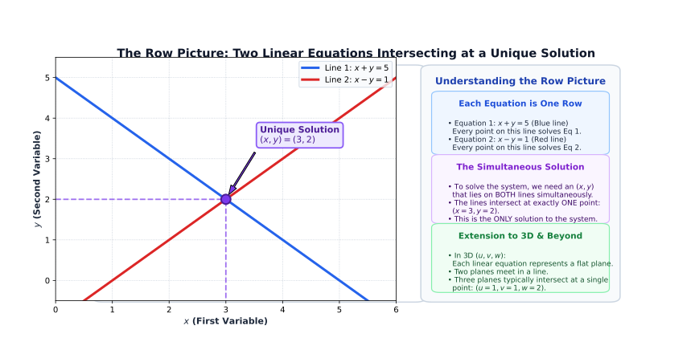
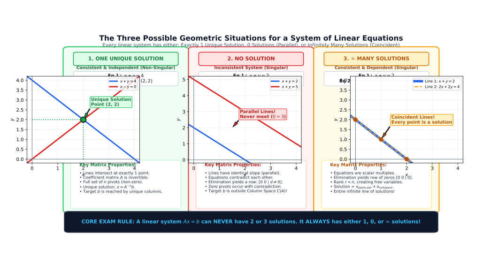
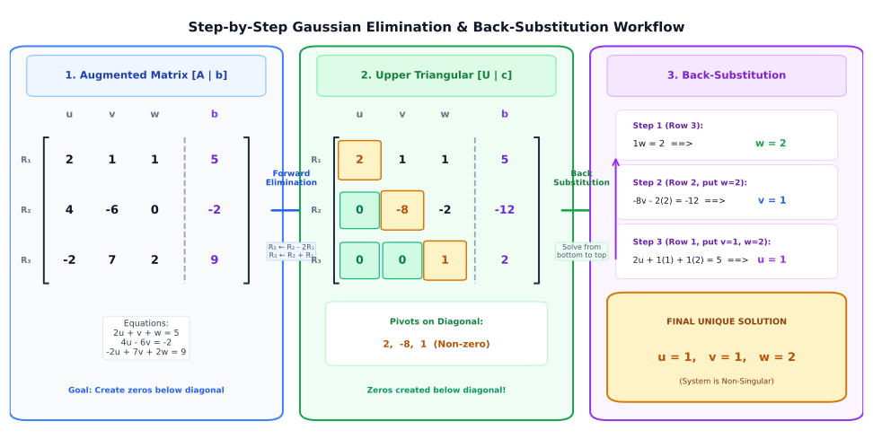
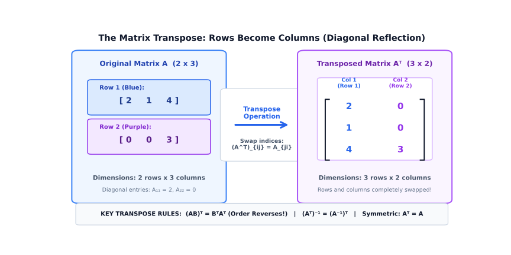

# 📘 Chapter 1: Linear Systems, Matrices & Gaussian Elimination

> **Study Guide & Course Notes**  
> An intuitive, ground-up introduction to linear algebra covering linear systems, matrices, Gaussian elimination, pivots, back-substitution, matrix multiplication, $LU$ factorization, inverses, transposes, and symmetric matrices.

---

## What is This Chapter Really About?

The whole chapter is trying to answer one main question:

> **How can we solve many equations at the same time using matrices?**

For example, you may already know how to solve a single linear equation:

$$2x + 3 = 7$$

You subtract $3$:

$$2x = 4$$

and divide by $2$:

$$x = 2$$

This chapter does something similar, but with **many unknowns** and **many equations simultaneously**.

For example:

$$2u + v + w = 5$$

$$4u - 6v = -2$$

$$-2u + 7v + 2w = 9$$

We want to find the unknown values:

$$u, \quad v, \quad w$$

The unique solution is:

$$\boxed{u = 1, \quad v = 1, \quad w = 2}$$

---

## 1. Linear Equations

Let's start with something you already know from basic algebra.

### Example

$$2x + 3 = 7$$

This is a **linear equation**.

### Why is it linear?

Because the variable $x$ is only multiplied by a constant number and added or subtracted. The exponent of $x$ is strictly $1$.

**More examples of linear equations:**

$$2x + 5 = 10$$

$$3x + 2y = 8$$

$$2x + 3y + z = 10$$

**Non-linear examples (NOT linear equations):**

$$x^2 + 3 = 7$$
*(Not linear because $x^2$ is involved)*

$$\frac{1}{x} = 5$$
*(Not linear because $x$ is in the denominator, i.e., $x^{-1}$)*

### Intuitive Meaning

> **Linear equation:** An equation where all variables appear only to the first power ($x^1$) and are not multiplied by each other.

---

## 2. Linear Systems

A **linear system** simply means:

> **Several linear equations that we want to solve together at the same time.**

### Example

$$x + y = 5$$

$$x - y = 1$$

We need to find values of $x$ and $y$ that satisfy **both** equations simultaneously.

**Step 1: Add the equations to eliminate $y$:**

$$(x + y) + (x - y) = 5 + 1$$

$$2x = 6$$

$$x = 3$$

**Step 2: Substitute $x = 3$ back into the first equation:**

$$3 + y = 5$$

$$y = 2$$

So the unique solution is:

$$\boxed{x = 3, \quad y = 2}$$

That is the fundamental idea behind the entire chapter.

---

## 3. What is a Matrix?

You will see matrices everywhere in linear algebra.

A **matrix** is fundamentally a **rectangular box or table of numbers arranged in rows and columns**.

For example:

$$A = \begin{bmatrix}
2 & 1 & 1 \\
4 & -6 & 0 \\
-2 & 7 & 2
\end{bmatrix}$$

Don't be intimidated by the brackets. It is simply a structured table:

| Row | Column 1 | Column 2 | Column 3 |
| :--- | :---: | :---: | :---: |
| **Row 1** | $2$ | $1$ | $1$ |
| **Row 2** | $4$ | $-6$ | $0$ |
| **Row 3** | $-2$ | $7$ | $2$ |

---

### Rows and Columns

Very important distinction to remember:

#### Row (Horizontal)
Goes **left $\rightarrow$ right**.

$$\boxed{2 \quad 1 \quad 1}$$

is the **first row** ($R_1$).

#### Column (Vertical)
Goes **top $\downarrow$ bottom**.

$$\boxed{\begin{bmatrix}
2 \\
4 \\
-2
\end{bmatrix}}$$

is the **first column** ($C_1$).

> **Memory Rule:**  
> - **Row** = horizontal (left to right)  
> - **Column** = vertical (top to bottom, like Greek columns in architecture)

---

## 4. Matrix Dimensions: What Does $3 \times 3$ Mean?

If you see the notation:

$$3 \times 3$$

for a matrix, it indicates the **dimensions** of the matrix:

$$\text{Rows} \times \text{Columns} \quad (m \times n)$$

**Example:**

$$A = \begin{bmatrix}
2 & 1 & 1 \\
4 & -6 & 0 \\
-2 & 7 & 2
\end{bmatrix}$$

This matrix has:
- **$3$ rows**
- **$3$ columns**

Therefore, it is a **$3 \times 3$ square matrix** (called the **coefficient matrix** of the linear system).

---

## 5. Matrix Form: $Ax = b$

This is one of the most fundamental notations in all of linear algebra:

$$\boxed{Ax = b}$$

Don't worry—it is simply a compact, elegant shorthand for writing an entire system of equations.

Consider the system:

$$2u + v + w = 5$$

$$4u - 6v + 0w = -2$$

$$-2u + 7v + 2w = 9$$

In matrix form, this is written as:

$$\begin{bmatrix}
2 & 1 & 1 \\
4 & -6 & 0 \\
-2 & 7 & 2
\end{bmatrix}
\begin{bmatrix}
u \\
v \\
w
\end{bmatrix}
=
\begin{bmatrix}
5 \\
-2 \\
9
\end{bmatrix}$$

Where we define:
- **Coefficient Matrix $A$:**
  $$\boxed{A = \begin{bmatrix}
  2 & 1 & 1 \\
  4 & -6 & 0 \\
  -2 & 7 & 2
  \end{bmatrix}}$$

- **Vector of Unknowns $x$:**
  $$\boxed{x = \begin{bmatrix}
  u \\
  v \\
  w
  \end{bmatrix}}$$

- **Vector of Right-Hand Side Constants $b$:**
  $$\boxed{b = \begin{bmatrix}
  5 \\
  -2 \\
  9
  \end{bmatrix}}$$

So the equation:

$$\boxed{Ax = b}$$

literally means:

> **[Coefficient Matrix $A$] $\times$ [Unknowns $x$] = [Outputs $b$]**

---

## 6. The Geometry of Linear Equations (Row vs. Column Picture)

Geometry in linear algebra means thinking about equations visually as **lines, planes, and intersection points**.

### One Equation: A Line in 2D

$$x + y = 5$$

This single equation represents a straight line in two-dimensional space.

### Two Equations: Intersecting Lines

$$x + y = 5$$

$$x - y = 1$$

These represent two intersecting lines. They meet at precisely one point:

$$(x, y) = (3, 2)$$

That meeting point is the **solution** to the linear system.


 In 3D space, each linear equation represents a **flat plane**, and three equations typically intersect at a single point $(u, v, w)$.

---

## 7. Three Possible Geometric Situations

When solving any system of linear equations, there are exactly **three possibilities**:




### Situation 1: One Unique Solution
The lines intersect at a single distinct point.

```text
    \   /
     \ /
      X  ← (Single intersection point)
     /     /   ```

- **Result:** Exactly one unique solution.

---

### Situation 2: No Solution (Inconsistent System)
The lines are parallel and never meet.

```text
──────────────────────  Line 1
──────────────────────  Line 2 (Parallel, never intersects)
```

- **Result:** No solution. In 3D, planes may be parallel or form a triangular prism with no common intersection.

---

### Situation 3: Infinitely Many Solutions (Dependent System)
Both equations describe the exact same line or plane.

```text
══════════════════════  Line 1 and Line 2 lie on top of each other
```

- **Result:** Infinitely many solutions (every point on the line satisfies both equations).

---

## 8. Singular vs. Non-Singular Systems

These terms frequently appear in exams and coursework:

### Non-Singular System
A square system that has **exactly one unique solution**.

$$\boxed{\text{Non-singular} \iff \text{Exactly one unique solution}}$$

For our main system:

$$u = 1, \quad v = 1, \quad w = 2$$

Since there is one unique solution, the coefficient matrix $A$ is **non-singular** (invertible).

---

### Singular System
A system that does **NOT** have a single unique solution. It either has:

$$\boxed{\text{No solution}} \quad \text{or} \quad \boxed{\text{Infinitely many solutions}}$$

- If the required target vector $b$ lies outside the span of the planes, there is **no solution**.
- If the system is singular and $b$ lies inside the common intersection, there are **infinitely many solutions**.

---

## 9. Gaussian Elimination ⭐

**Gaussian elimination** is the primary, systematic calculation method used in linear algebra to solve linear systems.

> **Gaussian Elimination:** A systematic algorithm of row operations that simplifies equations into an upper triangular system until finding the unknowns via back-substitution becomes straightforward.

### 2D Intuition

$$2x + y = 5 \quad (1)$$

$$4x + 3y = 11 \quad (2)$$

We eliminate $x$ from the second equation:
1. Multiply equation (1) by $2$:
   $$4x + 2y = 10$$
2. Subtract this from equation (2):
   $$(4x + 3y) - (4x + 2y) = 11 - 10 \implies y = 1$$
3. Back-substitute $y = 1$ into equation (1):
   $$2x + 1 = 5 \implies 2x = 4 \implies x = 2$$

That is the exact core mechanic of Gaussian elimination.

---

## 10. Step-by-Step Gaussian Elimination Example

Let's trace the $3 \times 3$ system:

$$2u + v + w = 5$$

$$4u - 6v = -2$$

$$-2u + 7v + 2w = 9$$

We write the system as an **augmented matrix** $[A \mid b]$:

$$\left[\begin{array}{ccc|c}
2 & 1 & 1 & 5 \\
4 & -6 & 0 & -2 \\
-2 & 7 & 2 & 9
\end{array}\right]$$

### Forward Elimination:
The objective is to produce **zeros underneath the main diagonal** using systematic row operations.

#### Step 1: Eliminate $u$ from Row 2
We use the first pivot ($2$ in Row 1) to eliminate the $4$ in Row 2. The multiplier is $\frac{4}{2} = 2$:

$$\text{Row 2} \leftarrow \text{Row 2} - 2(\text{Row 1})$$

**Middle calculations for Row 2:**
* First entry: $4 - 2(2) = 4 - 4 = 0$
* Second entry: $-6 - 2(1) = -6 - 2 = -8$
* Third entry: $0 - 2(1) = 0 - 2 = -2$
* Right-hand side: $-2 - 2(5) = -2 - 10 = -12$

---

#### Step 2: Eliminate $u$ from Row 3
We use the first pivot ($2$ in Row 1) to eliminate the $-2$ in Row 3. The multiplier is $\frac{-2}{2} = -1$:

$$\text{Row 3} \leftarrow \text{Row 3} - (-1)(\text{Row 1}) \implies \text{Row 3} \leftarrow \text{Row 3} + 1(\text{Row 1})$$

**Middle calculations for Row 3:**
* First entry: $-2 + 1(2) = -2 + 2 = 0$
* Second entry: $7 + 1(1) = 7 + 1 = 8$
* Third entry: $2 + 1(1) = 2 + 1 = 3$
* Right-hand side: $9 + 1(5) = 9 + 5 = 14$

**Intermediate matrix after Steps 1 and 2:**

$$\left[\begin{array}{ccc|c}
2 & 1 & 1 & 5 \\
0 & -8 & -2 & -12 \\
0 & 8 & 3 & 14
\end{array}\right]$$

---

#### Step 3: Eliminate $v$ from Row 3
Now we move to the second column. The new pivot is $-8$ in Row 2. We eliminate the $8$ in Row 3. The multiplier is $\frac{8}{-8} = -1$:

$$\text{Row 3} \leftarrow \text{Row 3} - (-1)(\text{Row 2}) \implies \text{Row 3} \leftarrow \text{Row 3} + 1(\text{Row 2})$$

**Middle calculations for Row 3:**
* First entry: $0 + 1(0) = 0$
* Second entry: $8 + 1(-8) = 8 - 8 = 0$
* Third entry: $3 + 1(-2) = 3 - 2 = 1$
* Right-hand side: $14 + 1(-12) = 14 - 12 = 2$

**Final Upper Triangular augmented matrix $[U \mid c]$:**

$$\left[\begin{array}{ccc|c}
2 & 1 & 1 & 5 \\
0 & -8 & -2 & -12 \\
0 & 0 & 1 & 2
\end{array}\right]$$

---

### Back-Substitution:
From the bottom row up, solve for each unknown:

1. **Bottom row ($w$):**
   $$1w = 2 \implies w = 2$$

2. **Middle row ($v$):**
   $$-8v - 2w = -12$$
   Substitute $w = 2$:
   $$-8v - 2(2) = -12$$
   $$-8v - 4 = -12$$
   $$-8v = -8 \implies v = 1$$

3. **Top row ($u$):**
   $$2u + 1v + 1w = 5$$
   Substitute $v = 1$ and $w = 2$:
   $$2u + 1(1) + 1(2) = 5$$
   $$2u + 3 = 5$$
   $$2u = 2 \implies u = 1$$

The unique solution is:

$$\boxed{u = 1, \quad v = 1, \quad w = 2}$$



---

## 11. What is a Pivot?

A **pivot** is the non-zero leading coefficient in a row used to eliminate entries below it in the same column.

In our upper triangular matrix:

$$\begin{bmatrix}
\mathbf{2} & 1 & 1 \\
0 & \mathbf{-8} & -2 \\
0 & 0 & \mathbf{1}
\end{bmatrix}$$

The pivots are:

$$\boxed{\text{Pivots} = 2, \quad -8, \quad 1}$$

Notice they sit along the **main diagonal**.

### Important Pivot Rule
> **A pivot cannot be zero!**  
> If a zero appears in a pivot position, we must exchange that row with a lower row that has a non-zero entry. If no such row exists, the elimination breaks down and the matrix is singular.

---

## 12. Back-Substitution

**Back-substitution** is the process of solving the triangular system by working backwards from the last equation to the first.

Given:

$$2u + v + w = 5$$

$$-8v - 2w = -12$$

$$w = 2$$

### Step 1: Solve for the lowest variable
$$w = 2$$

### Step 2: Substitute $w = 2$ into the middle equation
$$-8v - 2(2) = -12$$

$$-8v - 4 = -12$$

$$-8v = -8 \implies v = 1$$

### Step 3: Substitute $v = 1$ and $w = 2$ into the top equation
$$2u + 1 + 2 = 5$$

$$2u = 2 \implies u = 1$$

$$\boxed{u = 1, \quad v = 1, \quad w = 2}$$

---

## 13. Matrix Multiplication

Matrix multiplication is calculated using the **Row $\times$ Column rule**:

> **Rule:** To find entry $(i, j)$ in the product $AB$, multiply each number across row $i$ of $A$ by the corresponding number down column $j$ of $B$, then add all the products together.

### Example

$$\begin{bmatrix}
1 & 2 \\
0 & 3
\end{bmatrix}
\begin{bmatrix}
1 & 2 & 3 \\
4 & 5 & 6
\end{bmatrix}$$

Let's calculate each of the $2 \times 3 = 6$ entries using **Row $\times$ Column**:

* **Entry $(1, 1)$ (Row 1 of $A$ × Col 1 of $B$):**
  $$[1 \quad 2] \begin{bmatrix} 1 \\ 4 \end{bmatrix} = 1(1) + 2(4) = 1 + 8 = 9$$

* **Entry $(1, 2)$ (Row 1 of $A$ × Col 2 of $B$):**
  $$[1 \quad 2] \begin{bmatrix} 2 \\ 5 \end{bmatrix} = 1(2) + 2(5) = 2 + 10 = 12$$

* **Entry $(1, 3)$ (Row 1 of $A$ × Col 3 of $B$):**
  $$[1 \quad 2] \begin{bmatrix} 3 \\ 6 \end{bmatrix} = 1(3) + 2(6) = 3 + 12 = 15$$

* **Entry $(2, 1)$ (Row 2 of $A$ × Col 1 of $B$):**
  $$[0 \quad 3] \begin{bmatrix} 1 \\ 4 \end{bmatrix} = 0(1) + 3(4) = 0 + 12 = 12$$

* **Entry $(2, 2)$ (Row 2 of $A$ × Col 2 of $B$):**
  $$[0 \quad 3] \begin{bmatrix} 2 \\ 5 \end{bmatrix} = 0(2) + 3(5) = 0 + 15 = 15$$

* **Entry $(2, 3)$ (Row 2 of $A$ × Col 3 of $B$):**
  $$[0 \quad 3] \begin{bmatrix} 3 \\ 6 \end{bmatrix} = 0(3) + 3(6) = 0 + 18 = 18$$

Placing all $6$ calculated numbers into the product matrix gives:

$$\begin{bmatrix}
9 & 12 & 15 \\
12 & 15 & 18
\end{bmatrix}$$

---

## 14. How to Remember Matrix Multiplication (Row × Column)

Always remember:

$$\mathbf{\text{Row} \times \text{Column}}$$

To calculate:

$$AB$$

1. Take a **horizontal row** from $A$.
2. Take a **vertical column** from $B$.
3. Multiply matched pairs and sum them up.

$$\begin{bmatrix} 1 & 2 \end{bmatrix} \begin{bmatrix} 4 \\ 5 \end{bmatrix} = 1(4) + 2(5) = 4 + 10 = 14$$

---

## 15. The Column Perspective on Matrix Multiplication

Matrix multiplication can also be viewed by columns:

> **Column View:** Each column of $AB$ is a linear combination of the columns of $A$, weighted by the numbers in that column of $B$.

While the row $\times$ column method is great for calculations, the column view is essential for understanding vector spaces in Chapter 2.

---

## 16. Row Exchanges (Permutations)

During elimination, if a pivot is zero, we must **exchange rows**.

Suppose:

$$A = \begin{bmatrix}
a & b \\
c & d
\end{bmatrix}$$

Exchanging Row 1 and Row 2 gives:

$$\begin{bmatrix}
c & d \\
a & b
\end{bmatrix}$$

---

## 17. Column Exchanges

Similarly, exchanging Column 1 and Column 2 gives:

$$\begin{bmatrix}
b & a \\
d & c
\end{bmatrix}$$

Exchanging rows corresponds to multiplying on the left by a permutation matrix $P$, while exchanging columns corresponds to multiplying on the right by $P$.

---

## 18. Permutation Matrices ($P$)

A **permutation matrix** $P$ is an identity matrix with its rows reordered. When multiplied by another matrix, it rearranges that matrix's rows.

**Example:**

$$P = \begin{bmatrix}
0 & 1 \\
1 & 0
\end{bmatrix}$$

If:

$$A = \begin{bmatrix}
a & b \\
c & d
\end{bmatrix}$$

Then multiplying $PA$ on the left swaps Row 1 and Row 2:

$$PA = \begin{bmatrix}
0 & 1 \\
1 & 0
\end{bmatrix}
\begin{bmatrix}
a & b \\
c & d
\end{bmatrix}
=
\begin{bmatrix}
c & d \\
a & b
\end{bmatrix}$$

---

## 19. Upper Triangular Matrices ($U$)

An **upper triangular matrix** $U$ has only zeros **below** its main diagonal:

$$U = \begin{bmatrix}
2 & 1 & 1 \\
0 & -8 & -2 \\
0 & 0 & 1
\end{bmatrix}$$

- The diagonal entries are: $2, -8, 1$.
- Everything below the diagonal is strictly $0$.

$$\boxed{\text{Upper Triangular } U \iff \text{Zeros below the main diagonal}}$$

---

## 20. Lower Triangular Matrices ($L$)

A **lower triangular matrix** $L$ has only zeros **above** its main diagonal. 

In Gaussian elimination, $L$ stores the exact multipliers used during elimination:

$$L = \begin{bmatrix}
1 & 0 & 0 \\
l_{21} & 1 & 0 \\
l_{31} & l_{32} & 1
\end{bmatrix}
=
\begin{bmatrix}
1 & 0 & 0 \\
2 & 1 & 0 \\
-1 & -1 & 1
\end{bmatrix}$$

**Where do these numbers come from?**
* The diagonal entries are always $1$.
* $l_{21} = 2$: The multiplier from Step 1 ($\text{Row 2} - \mathbf{2}\,\text{Row 1}$).
* $l_{31} = -1$: The multiplier from Step 2 ($\text{Row 3} - (\mathbf{-1})\,\text{Row 1}$).
* $l_{32} = -1$: The multiplier from Step 3 ($\text{Row 3} - (\mathbf{-1})\,\text{Row 2}$).

$$\boxed{\text{Lower Triangular } L \iff \text{Zeros above the main diagonal, multipliers below}}$$

---

## 21. $LU$ Factorization ($A = LU$) ⭐

**$LU$ Factorization** decomposes matrix $A$ into the product of a unit lower triangular matrix $L$ and an upper triangular matrix $U$:

$$\boxed{A = LU}$$

Where:
- $U$ is the **upper triangular matrix** produced by forward Gaussian elimination.
- $L$ is the **lower triangular matrix** containing the elimination multipliers below the diagonal, with $1$'s on the diagonal.

### Verification Check ($L \times U = A$):

Let's multiply $L$ and $U$ using **Row $\times$ Column** to verify it recovers $A$ exactly:

$$LU =
\begin{bmatrix}
1 & 0 & 0 \\
2 & 1 & 0 \\
-1 & -1 & 1
\end{bmatrix}
\begin{bmatrix}
2 & 1 & 1 \\
0 & -8 & -2 \\
0 & 0 & 1
\end{bmatrix}$$

**Middle calculations:**
* **Row 1:**
  * $(1)(2) + 0 + 0 = 2$
  * $(1)(1) + 0 + 0 = 1$
  * $(1)(1) + 0 + 0 = 1$
* **Row 2:**
  * $(2)(2) + (1)(0) + 0 = 4$
  * $(2)(1) + (1)(-8) + 0 = 2 - 8 = -6$
  * $(2)(1) + (1)(-2) + 0 = 2 - 2 = 0$
* **Row 3:**
  * $(-1)(2) + (-1)(0) + (1)(0) = -2$
  * $(-1)(1) + (-1)(-8) + (1)(0) = -1 + 8 = 7$
  * $(-1)(1) + (-1)(-2) + (1)(1) = -1 + 2 + 1 = 2$

Putting it all together:

$$LU =
\begin{bmatrix}
2 & 1 & 1 \\
4 & -6 & 0 \\
-2 & 7 & 2
\end{bmatrix}
= A \quad \checkmark$$

---

## 22. Why Use $LU$ Factorization?

Suppose you need to solve:

$$Ax = b$$

for many different right-hand sides $b$. Instead of re-running full elimination each time:
1. Factorize $A = LU$ once.
2. Substitute $A = LU$ into the system: $LUx = b$.
3. Let $Ux = c$, then solve $Lc = b$ by **forward substitution**.
4. Solve $Ux = c$ by **back-substitution** to find $x$.

### Full Step-by-Step Calculation:

Let $b = \begin{bmatrix} 5 \\ -2 \\ 9 \end{bmatrix}$.

#### Step 1: Solve $Lc = b$ (Forward substitution)
$$\begin{bmatrix}
1 & 0 & 0 \\
2 & 1 & 0 \\
-1 & -1 & 1
\end{bmatrix}
\begin{bmatrix}
c_1 \\ c_2 \\ c_3
\end{bmatrix}
=
\begin{bmatrix}
5 \\ -2 \\ 9
\end{bmatrix}$$

Working from the top down:
* **Row 1:** $1 c_1 = 5 \implies c_1 = 5$
* **Row 2:** $2 c_1 + 1 c_2 = -2 \implies 2(5) + c_2 = -2 \implies c_2 = -2 - 10 = -12$
* **Row 3:** $-1 c_1 - 1 c_2 + 1 c_3 = 9 \implies -(5) - (-12) + c_3 = 9 \implies 7 + c_3 = 9 \implies c_3 = 2$

So:
$$c = \begin{bmatrix} 5 \\ -12 \\ 2 \end{bmatrix}$$
*(Notice: $c$ is identical to the modified right-hand side from forward elimination!)*

#### Step 2: Solve $Ux = c$ (Back-substitution)
$$\begin{bmatrix}
2 & 1 & 1 \\
0 & -8 & -2 \\
0 & 0 & 1
\end{bmatrix}
\begin{bmatrix}
u \\ v \\ w
\end{bmatrix}
=
\begin{bmatrix}
5 \\ -12 \\ 2
\end{bmatrix}$$

Working from the bottom up:
* **Row 3:** $1w = 2 \implies w = 2$
* **Row 2:** $-8v - 2w = -12 \implies -8v - 2(2) = -12 \implies -8v = -8 \implies v = 1$
* **Row 1:** $2u + 1v + 1w = 5 \implies 2u + 1(1) + 1(2) = 5 \implies 2u + 3 = 5 \implies u = 1$

$$\boxed{u = 1, \quad v = 1, \quad w = 2} \quad \checkmark$$

> **Key Takeaway:** $LU$ factorization separates the time-consuming elimination on $A$ from the specific right-hand side vector $b$. For any new $b$, we only do two fast triangular substitutions!

---

## 23. Matrix Inverses ($A^{-1}$) ⭐⭐⭐

In ordinary arithmetic, every non-zero number has a reciprocal (multiplicative inverse):

$$5 \times \frac{1}{5} = 1$$

The exact same concept exists for square matrices.

### Definition of Matrix Inverse
If $A$ is an $n \times n$ matrix, its **inverse** $A^{-1}$ satisfies:

$$\boxed{A A^{-1} = I \quad \text{and} \quad A^{-1} A = I}$$

where $I$ is the identity matrix.

---

## 24. The Identity Matrix ($I$)

The **identity matrix** $I$ acts as the number $1$ for matrix multiplication:

$$I = \begin{bmatrix}
1 & 0 & 0 \\
0 & 1 & 0 \\
0 & 0 & 1
\end{bmatrix}$$

For any compatible matrix $A$:

$$A \times I = A \quad \text{and} \quad I \times A = A$$

$$\boxed{I = \text{The matrix equivalent of the number } 1}$$

---

## 25. Why is the Inverse Useful? ($x = A^{-1}b$)

If we have the system:

$$Ax = b$$

Multiply both sides on the left by $A^{-1}$:

$$A^{-1}(Ax) = A^{-1}b$$

$$(A^{-1}A)x = A^{-1}b$$

$$Ix = A^{-1}b$$

$$\boxed{x = A^{-1}b}$$

This provides an explicit formula for the exact solution vector $x$.

---

## 26. When Does an Inverse Exist? (Invertibility Criteria)

> **Invertibility Theorem:**  
> An $n \times n$ matrix $A$ is invertible ($A^{-1}$ exists) **if and only if** Gaussian elimination produces $n$ non-zero pivots.

- For a $3 \times 3$ matrix: **Must have 3 non-zero pivots**.
- For an $n \times n$ matrix: **Must have $n$ non-zero pivots**.

If elimination produces a zero in any pivot position that cannot be fixed by row exchange, the matrix is **singular** and has **no inverse**.

---

## 27. The Gauss-Jordan Method

While standard Gaussian elimination reduces $A$ to upper triangular form $U$, the **Gauss-Jordan method** continues elimination upwards to eliminate entries above the pivots as well, scaling every pivot to $1$.

$$\text{Standard Elimination:} \quad A \longrightarrow U = \begin{bmatrix} * & * & * \\ 0 & * & * \\ 0 & 0 & * \end{bmatrix}$$

$$\text{Gauss-Jordan Elimination:} \quad A \longrightarrow I = \begin{bmatrix} 1 & 0 & 0 \\ 0 & 1 & 0 \\ 0 & 0 & 1 \end{bmatrix}$$

### How Gauss-Jordan Works (Step-by-Step):

Start with the matrix in upper triangular form:

$$\begin{bmatrix}
1 & 2 \\
0 & -2
\end{bmatrix}$$

1. **Scale the second pivot to $1$ ($R_2 \leftarrow -\frac{1}{2}R_2$):**
   * First entry: $-\frac{1}{2}(0) = 0$
   * Second entry: $-\frac{1}{2}(-2) = 1$
   $$\begin{bmatrix} 1 & 2 \\ 0 & 1 \end{bmatrix}$$

2. **Eliminate the entry above the pivot ($R_1 \leftarrow R_1 - 2R_2$):**
   * First entry: $1 - 2(0) = 1 - 0 = 1$
   * Second entry: $2 - 2(1) = 2 - 2 = 0$
   $$\boxed{\begin{bmatrix} 1 & 0 \\ 0 & 1 \end{bmatrix}}$$

---

## 28. Finding $A^{-1}$ via $[A \mid I] \rightarrow [I \mid A^{-1}]$

The Gauss-Jordan algorithm computes $A^{-1}$ by augmenting $A$ with the identity matrix $I$:

$$[A \mid I]$$

Perform row operations on the entire augmented matrix until the left side becomes the identity matrix $I$:

$$\boxed{\left[A \mid I\right] \xrightarrow{\text{Row Operations}} \left[I \mid A^{-1}\right]}$$

When the left half becomes $I$, the right half is automatically guaranteed to be $A^{-1}$.

### Full Step-by-Step Gauss-Jordan Inversion Example:

Let $A = \begin{bmatrix} 1 & 2 \\ 3 & 4 \end{bmatrix}$. Set up $[A \mid I]$:

$$\left[\begin{array}{cc|cc}
1 & 2 & 1 & 0 \\
3 & 4 & 0 & 1
\end{array}\right]$$

#### Step 1: Eliminate below the first pivot ($R_2 \leftarrow R_2 - 3R_1$)
**Middle calculations for Row 2:**
* Column 1: $3 - 3(1) = 3 - 3 = 0$
* Column 2: $4 - 3(2) = 4 - 6 = -2$
* Column 3: $0 - 3(1) = 0 - 3 = -3$
* Column 4: $1 - 3(0) = 1 - 0 = 1$

$$\left[\begin{array}{cc|cc}
1 & 2 & 1 & 0 \\
0 & -2 & -3 & 1
\end{array}\right]$$

#### Step 2: Make the second pivot equal to $1$ ($R_2 \leftarrow -\frac{1}{2}R_2$)
**Middle calculations for Row 2:**
* Column 1: $-\frac{1}{2}(0) = 0$
* Column 2: $-\frac{1}{2}(-2) = 1$
* Column 3: $-\frac{1}{2}(-3) = \frac{3}{2}$
* Column 4: $-\frac{1}{2}(1) = -\frac{1}{2}$

$$\left[\begin{array}{cc|cc}
1 & 2 & 1 & 0 \\
0 & 1 & \frac{3}{2} & -\frac{1}{2}
\end{array}\right]$$

#### Step 3: Eliminate above the second pivot ($R_1 \leftarrow R_1 - 2R_2$)
**Middle calculations for Row 1:**
* Column 1: $1 - 2(0) = 1 - 0 = 1$
* Column 2: $2 - 2(1) = 2 - 2 = 0$
* Column 3: $1 - 2\left(\frac{3}{2}\right) = 1 - 3 = -2$
* Column 4: $0 - 2\left(-\frac{1}{2}\right) = 0 - (-1) = 1$

$$\left[\begin{array}{cc|cc}
1 & 0 & -2 & 1 \\
0 & 1 & \frac{3}{2} & -\frac{1}{2}
\end{array}\right]$$

The left side is now $I$, so the right side is the inverse:

$$\boxed{A^{-1} = \begin{bmatrix} -2 & 1 \\ \frac{3}{2} & -\frac{1}{2} \end{bmatrix}}$$

#### Verification ($A A^{-1} = I$):
$$A A^{-1} =
\begin{bmatrix} 1 & 2 \\ 3 & 4 \end{bmatrix}
\begin{bmatrix} -2 & 1 \\ \frac{3}{2} & -\frac{1}{2} \end{bmatrix}$$
* Row 1 × Col 1: $(1)(-2) + (2)\left(\frac{3}{2}\right) = -2 + 3 = 1$
* Row 1 × Col 2: $(1)(1) + (2)\left(-\frac{1}{2}\right) = 1 - 1 = 0$
* Row 2 × Col 1: $(3)(-2) + (4)\left(\frac{3}{2}\right) = -6 + 6 = 0$
* Row 2 × Col 2: $(3)(1) + (4)\left(-\frac{1}{2}\right) = 3 - 2 = 1$

$$= \begin{bmatrix} 1 & 0 \\ 0 & 1 \end{bmatrix} = I \quad \checkmark$$

---

## 29. The Transpose of a Matrix ($A^T$) ⭐

The **transpose** of a matrix exchanges its rows and columns:

> **Transpose Rule:** Rows become columns, and columns become rows.

If:

$$A = \begin{bmatrix}
2 & 1 & 4 \\
0 & 0 & 3
\end{bmatrix} \quad (2 \times 3)$$

Then the transpose $A^T$ is:

$$A^T = \begin{bmatrix}
2 & 0 \\
1 & 0 \\
4 & 3
\end{bmatrix} \quad (3 \times 2)$$

* Row 1 of $A$ ($[2 \quad 1 \quad 4]$) $\longrightarrow$ Column 1 of $A^T$.
* Row 2 of $A$ ($[0 \quad 0 \quad 3]$) $\longrightarrow$ Column 2 of $A^T$.

---

## 30. Transpose Visual Trick (Reflection Across Main Diagonal)

Imagine flipping the matrix across its main diagonal line:

$$\begin{bmatrix}
\mathbf{2} & 1 & 4 \\
0 & \mathbf{0} & 3
\end{bmatrix}$$

The diagonal entries stay in place while all off-diagonal entries reflect across the diagonal.

$$\boxed{\text{Transpose } A^T: \quad (A^T)_{ij} = A_{ji}}$$



---

## 31. Important Transpose Rules: $(AB)^T = B^T A^T$

> **Reverse Order Law for Transposes:**
>
> $$\boxed{(AB)^T = B^T A^T}$$

Notice that the order of multiplication **reverses**:
- **Correct:** $(AB)^T = B^T A^T$
- **Incorrect:** $(AB)^T \neq A^T B^T$

### Numerical Example with Middle Calculations:

Let $A = \begin{bmatrix} 1 & 2 \\ 3 & 4 \end{bmatrix}$ and $B = \begin{bmatrix} 5 & 6 \\ 7 & 8 \end{bmatrix}$.

1. **Compute $AB$:**
   * Row 1 × Col 1: $(1)(5) + (2)(7) = 5 + 14 = 19$
   * Row 1 × Col 2: $(1)(6) + (2)(8) = 6 + 16 = 22$
   * Row 2 × Col 1: $(3)(5) + (4)(7) = 15 + 28 = 43$
   * Row 2 × Col 2: $(3)(6) + (4)(8) = 18 + 32 = 50$
   $$AB = \begin{bmatrix} 19 & 22 \\ 43 & 50 \end{bmatrix} \implies (AB)^T = \begin{bmatrix} 19 & 43 \\ 22 & 50 \end{bmatrix}$$

2. **Compute $B^T A^T$:**
   $$B^T = \begin{bmatrix} 5 & 7 \\ 6 & 8 \end{bmatrix}, \quad A^T = \begin{bmatrix} 1 & 3 \\ 2 & 4 \end{bmatrix}$$
   * Row 1 × Col 1: $(5)(1) + (7)(2) = 5 + 14 = 19$
   * Row 1 × Col 2: $(5)(3) + (7)(4) = 15 + 28 = 43$
   * Row 2 × Col 1: $(6)(1) + (8)(2) = 6 + 16 = 22$
   * Row 2 × Col 2: $(6)(3) + (8)(4) = 18 + 32 = 50$
   $$B^T A^T = \begin{bmatrix} 19 & 43 \\ 22 & 50 \end{bmatrix}$$

Both sides are identical: $(AB)^T = B^T A^T$. $\checkmark$

---

## 32. Inverse and Transpose Commute: $(A^T)^{-1} = (A^{-1})^T$

$$\boxed{(A^T)^{-1} = (A^{-1})^T}$$

> **Key Rule:** You can transpose first and then invert, or invert first and then transpose. Both operations yield the exact same result.

### Numerical Example:
Let $A = \begin{bmatrix} 1 & 2 \\ 3 & 4 \end{bmatrix}$.

* **Way 1 (Transpose first, then invert):**
  $$A^T = \begin{bmatrix} 1 & 3 \\ 2 & 4 \end{bmatrix}$$
  $$\det(A^T) = (1)(4) - (3)(2) = 4 - 6 = -2$$
  $$(A^T)^{-1} = -\frac{1}{2}\begin{bmatrix} 4 & -3 \\ -2 & 1 \end{bmatrix} = \begin{bmatrix} -2 & \frac{3}{2} \\ 1 & -\frac{1}{2} \end{bmatrix}$$

* **Way 2 (Invert first, then transpose):**
  From Section 28, $A^{-1} = \begin{bmatrix} -2 & 1 \\ \frac{3}{2} & -\frac{1}{2} \end{bmatrix}$.
  Transposing $A^{-1}$ (swap rows into columns):
  $$(A^{-1})^T = \begin{bmatrix} -2 & \frac{3}{2} \\ 1 & -\frac{1}{2} \end{bmatrix}$$

$$\boxed{(A^T)^{-1} = (A^{-1})^T = \begin{bmatrix} -2 & \frac{3}{2} \\ 1 & -\frac{1}{2} \end{bmatrix}} \quad \checkmark$$

---

## 33. Symmetric Matrices ($A^T = A$)

A square matrix is **symmetric** if it equals its own transpose:

$$\boxed{A^T = A}$$

### Example

$$A = \begin{bmatrix}
1 & 2 \\
2 & 8
\end{bmatrix}$$

Compute the transpose:

$$A^T = \begin{bmatrix}
1 & 2 \\
2 & 8
\end{bmatrix} = A$$

Since $A^T = A$, the matrix $A$ is **symmetric**.

---

## 34. Properties of $R^T R$ and $R R^T$

For any matrix $R$ (even if rectangular):

$$\boxed{R^T R \quad \text{and} \quad R R^T \quad \text{are always square, symmetric matrices}}$$

### Concrete Example with Calculations:

Let $R = \begin{bmatrix} 1 & 2 \\ 3 & 4 \\ 5 & 6 \end{bmatrix}$ ($3 \times 2$), so $R^T = \begin{bmatrix} 1 & 3 & 5 \\ 2 & 4 & 6 \end{bmatrix}$ ($2 \times 3$).

#### Calculate $R^TR$ ($2 \times 2$ square):
$$R^TR = \begin{bmatrix} 1 & 3 & 5 \\ 2 & 4 & 6 \end{bmatrix}\begin{bmatrix} 1 & 2 \\ 3 & 4 \\ 5 & 6 \end{bmatrix}$$
* Row 1 × Col 1: $1(1) + 3(3) + 5(5) = 1 + 9 + 25 = 35$
* Row 1 × Col 2: $1(2) + 3(4) + 5(6) = 2 + 12 + 30 = 44$
* Row 2 × Col 1: $2(1) + 4(3) + 6(5) = 2 + 12 + 30 = 44$
* Row 2 × Col 2: $2(2) + 4(4) + 6(6) = 4 + 16 + 36 = 56$

$$R^TR = \begin{bmatrix} 35 & 44 \\ 44 & 56 \end{bmatrix} \quad (\text{Symmetric because } 44 = 44!)$$

#### Calculate $RR^T$ ($3 \times 3$ square):
$$RR^T = \begin{bmatrix} 1 & 2 \\ 3 & 4 \\ 5 & 6 \end{bmatrix}\begin{bmatrix} 1 & 3 & 5 \\ 2 & 4 & 6 \end{bmatrix} = \begin{bmatrix} 5 & 11 & 17 \\ 11 & 25 & 39 \\ 17 & 39 & 61 \end{bmatrix}$$
Notice all symmetric pairs match ($a_{12}=a_{21}=11$, $a_{13}=a_{31}=17$, $a_{23}=a_{32}=39$).

### Proof of Symmetry:
Using the reverse order law:

$$(R^T R)^T = R^T (R^T)^T = R^T R$$

Since $(R^T R)^T = R^T R$, the product is always symmetric.

---

## 🧠 Concept Map: Chapter 1 in One Picture

```text
                     LINEAR EQUATIONS
                            │
                            ▼
                      Linear System
                            │
                            ▼
                       Matrix Form
                         Ax = b
                            │
                            ▼
                   Gaussian Elimination
                            │
                ┌───────────┴───────────┐
                ▼                       ▼
          Forward Elimination      Back-Substitution
                │                       │
                └───────────┬───────────┘
                            ▼
                         Solution
                      u=1, v=1, w=2
                            │
                            ▼
                     Matrix Concepts
                            │
             ┌──────────────┼──────────────┐
             ▼              ▼              ▼
         Multiplication   LU Factorization  Inverse (A⁻¹)
                                           │
                                           ▼
                                      Gauss-Jordan
                                     [A|I] → [I|A⁻¹]
                            │
                            ▼
                        Transpose (Aᵀ)
                            │
                            ▼
                    Symmetric Matrix (Aᵀ = A)
```

---

## ⭐ Exam Review: Key Definitions & Formulas

| # | Concept | Definition / Formula |
| :---: | :--- | :--- |
| **1** | **Matrix** | A rectangular arrangement of numbers into $m$ rows and $n$ columns. |
| **2** | **Row** | Horizontal entry slice ($m$). |
| **3** | **Column** | Vertical entry slice ($n$). |
| **4** | **Linear System** | Multiple linear equations solved simultaneously. |
| **5** | **Matrix Equation** | $\mathbf{Ax = b}$ |
| **6** | **Gaussian Elimination** | Systematic row operations transforming $A$ to upper triangular $U$. |
| **7** | **Pivot** | Leading non-zero coefficient used to clear values below it. |
| **8** | **Upper Triangular ($U$)** | All zeros below the main diagonal. |
| **9** | **Lower Triangular ($L$)** | All zeros above the main diagonal. |
| **10** | **$LU$ Factorization** | $\mathbf{A = LU}$ |
| **11** | **Identity Matrix ($I$)** | Square matrix with $1$'s on diagonal, $0$'s elsewhere ($AI = IA = A$). |
| **12** | **Matrix Inverse ($A^{-1}$)** | $\mathbf{A A^{-1} = A^{-1} A = I}$ |
| **13** | **Gauss-Jordan Method** | $\mathbf{[A \mid I] \longrightarrow [I \mid A^{-1}]}$ |
| **14** | **Transpose ($A^T$)** | Swaps rows and columns; $\mathbf{(AB)^T = B^T A^T}$. |
| **15** | **Symmetric Matrix** | $\mathbf{A^T = A}$; products $R^T R$ and $R R^T$ are always symmetric. |

---

## 🚨 Recommended 7-Step Study Roadmap

For efficient revision, master the concepts in this order:

```text
Step 1: Matrix basics & notation
   ↓
Step 2: Rows, columns, and matrix dimensions (m × n)
   ↓
Step 3: Matrix multiplication (Row × Column rule)
   ↓
Step 4: Linear equations translated to matrix form (Ax = b)
   ↓
Step 5: Gaussian elimination, pivots, and back-substitution
   ↓
Step 6: Matrix inverse & Gauss-Jordan elimination ([A|I] → [I|A⁻¹])
   ↓
Step 7: LU factorization, transpose rules, and symmetric matrices
```

### Core Problem to Practice:
Take the standard $3 \times 3$ system:

$$2u + v + w = 5$$

$$4u - 6v = -2$$

$$-2u + 7v + 2w = 9$$

and practice the complete solution workflow:
1. Form the augmented matrix $[A \mid b]$.
2. Perform forward elimination to reach the upper triangular system $[U \mid c]$ with pivots $2$, $-8$, and $1$.
3. Execute back-substitution from $w$ up to $u$ to verify the solution:
   $$\boxed{u = 1, \quad v = 1, \quad w = 2}$$
