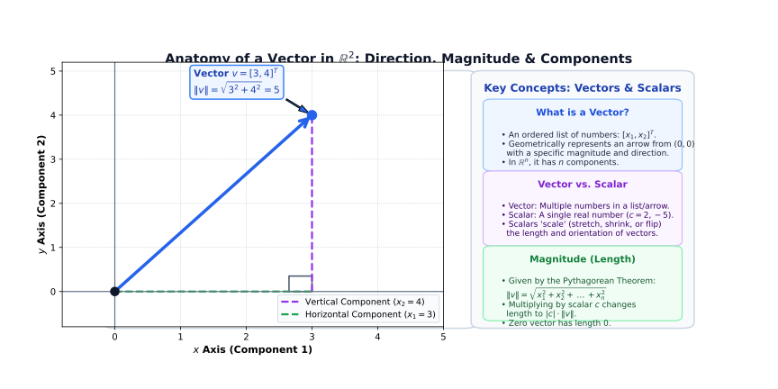
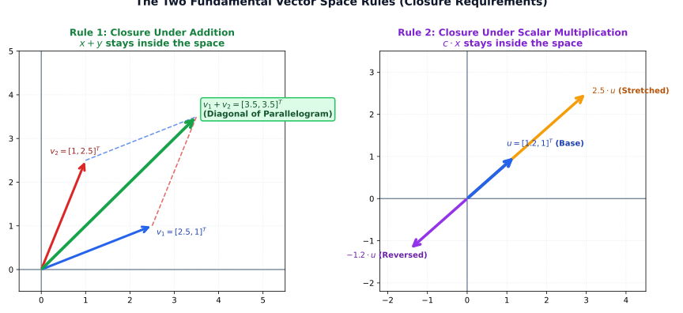
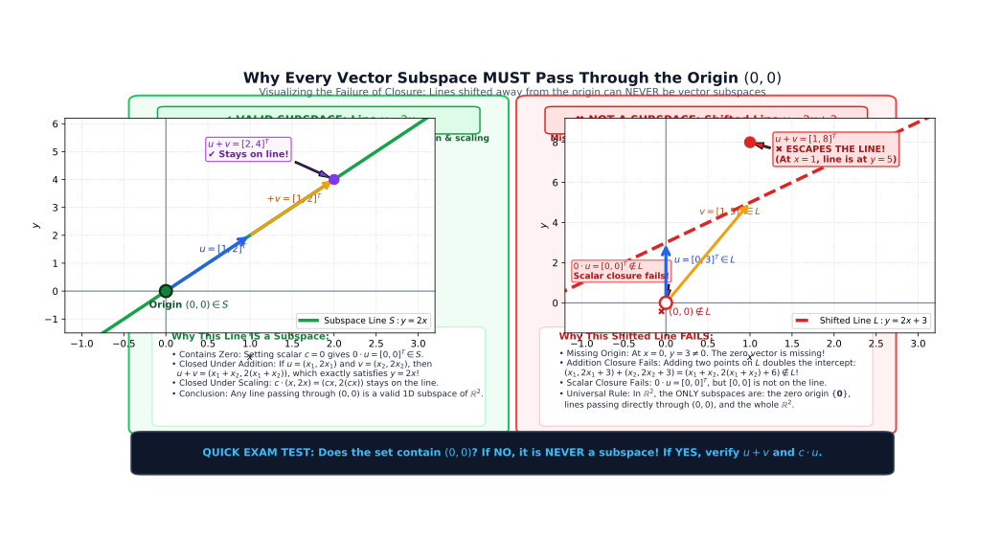
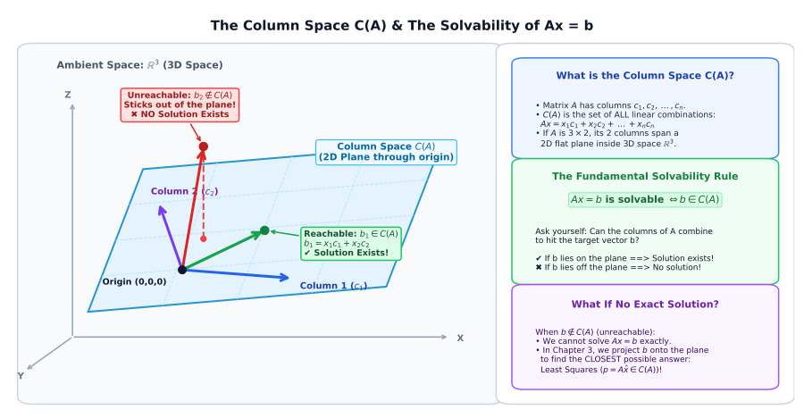
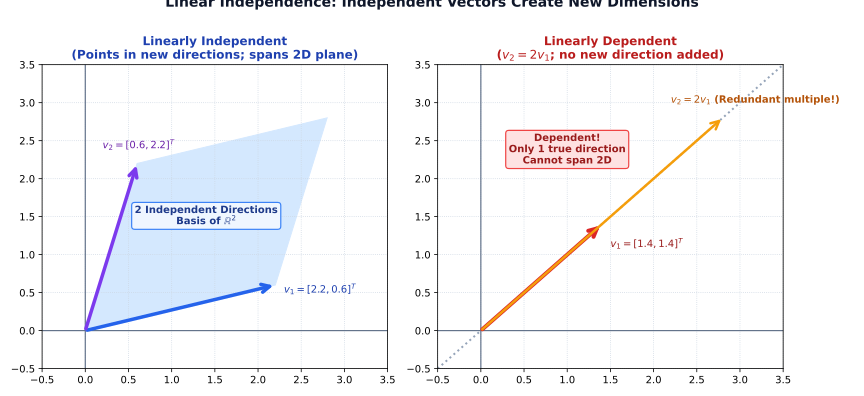
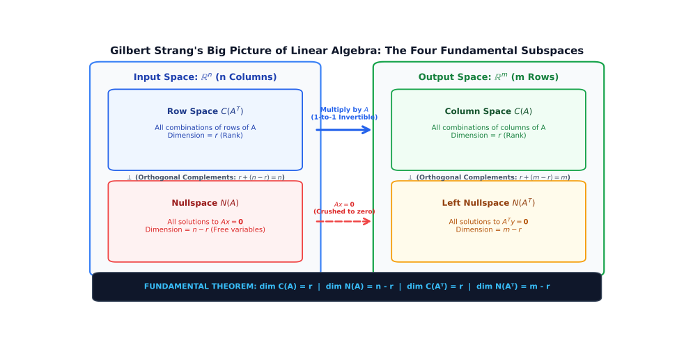

# 📘 Chapter 2: Vector Spaces, Subspaces & The Four Fundamental Subspaces

> **Study Guide & Course Notes**  
> A complete, intuitive exploration of vector spaces, subspaces, linear combinations, the column space $C(A)$, nullspace $N(A)$, pivots and free variables, matrix rank $r$, linear independence, bases, dimension, the Rank-Nullity Theorem, and the Four Fundamental Subspaces.

---

## What is This Chapter About?

The easiest way to understand the whole chapter is:

> **We have vectors and matrices, and we want to understand the geometric and algebraic "spaces" formed by those vectors.**

The chapter systematically answers these fundamental questions:
- *What vectors are allowed in a space?*
- *Can we add these vectors and stay in the space?*
- *Can we multiply them by scalars and stay in the space?*
- *Which vectors can a matrix produce as outputs?*
- *Which vectors become zero when multiplied by a matrix?*
- *How many truly independent directions exist?*
- *What is a basis?*
- *What is dimension?*
- *What are the Four Fundamental Subspaces of any matrix?*

The journey begins with basic vectors and culminates in the elegant **Four Fundamental Subspaces**.

---

## 1. What is a Vector?

Let's start from the ground up. A **vector** can simply be thought of as an **ordered list of numbers**.

For example, a 2D column vector:

$$\begin{bmatrix} 
2 \\ 
3 
\end{bmatrix}$$

A 3D column vector:

$$\begin{bmatrix} 
5 \\ 
1 \\ 
7 
\end{bmatrix}$$

Geometrically, you can visualize a vector as an **arrow** starting from the origin $(0,0)$ and pointing to a coordinate:

```text
  y ▲
    │         • (2, 3)
    │       /
    │     /
    │   /
    │ /
────┼─────────────────► x
    │ (0,0)
```

The vector specifies both a **direction** and a **magnitude (length)**.




---

## 2. What is $\mathbb{R}^2$?

You will frequently see the notation:

$$\boxed{\mathbb{R}^2}$$

Here, $\mathbb{R}$ stands for **Real numbers**, and the exponent $2$ indicates $2$ dimensions.

> **$\mathbb{R}^2$:** The set of all vectors containing exactly $2$ real numbers (the entire continuous 2D $x\text{-}y$ plane).

**Examples of vectors in $\mathbb{R}^2$:**

$$\begin{bmatrix} 2 \\ 5 \end{bmatrix}, \quad \begin{bmatrix} -1 \\ 4 \end{bmatrix}, \quad \begin{bmatrix} 0 \\ 0 \end{bmatrix} \quad \in \mathbb{R}^2$$

---

## 3. What is $\mathbb{R}^3$?

Similarly:

$$\boxed{\mathbb{R}^3}$$

means the set of all vectors with $3$ real components.

$$\begin{bmatrix} 2 \\ 4 \\ 7 \end{bmatrix} \in \mathbb{R}^3$$

**Geometric visualization:**
- $\mathbb{R}^1 \longrightarrow$ a 1D line
- $\mathbb{R}^2 \longrightarrow$ a flat 2D plane
- $\mathbb{R}^3 \longrightarrow$ our familiar 3D physical space

---

## 4. What is $\mathbb{R}^n$?

This is the generalized $n$-dimensional space:

$$\boxed{\mathbb{R}^n}$$

> **$\mathbb{R}^n$:** The space of all column vectors containing $n$ real numbers.

$$\begin{bmatrix} x_1 \\ x_2 \\ \vdots \\ x_n \end{bmatrix} \in \mathbb{R}^n$$

For instance, $\mathbb{R}^4$ contains vectors with $4$ numbers, and $\mathbb{R}^{100}$ contains vectors with $100$ numbers. While we cannot visually draw beyond 3 dimensions, the algebraic rules remain identical.

---

## 5. What Makes Something a Vector Space?

A **vector space** is a collection of vectors that is completely self-contained under two fundamental operations:

### Rule 1: Closure Under Addition
If you pick any two vectors $x$ and $y$ in the space and add them:

$$x + y$$

the resulting vector must still lie **inside** the space.




### Rule 2: Closure Under Scalar Multiplication
If you pick any vector $x$ in the space and multiply it by any real scalar number $c$:

$$cx$$

the resulting vector must still lie **inside** the space.

---

## 6. What is a Scalar?

A **scalar** is simply an **ordinary real number** (used to "scale" vectors).

Examples of scalars:

$$2, \quad -5, \quad 0.5, \quad 10, \quad \pi$$

If:

$$x = \begin{bmatrix} 2 \\ 3 \end{bmatrix}$$

then multiplying by the scalar $c = 3$ gives:

$$3x = 3 \begin{bmatrix} 2 \\ 3 \end{bmatrix} = \begin{bmatrix} 6 \\ 9 \end{bmatrix}$$

> **Memory Rule:**  
> - **Vector:** An ordered list/column of numbers.  
> - **Scalar:** A single ordinary scaling number.

---

## 7. What Does "Closed" Mean?

In mathematics, **closure** means you cannot escape the set using the allowed operations:

> **"Closed under addition and scalar multiplication":**  
> Performing vector addition or scalar multiplication on elements of the set will **never** produce a vector that lands outside the set.

**Example in $\mathbb{R}^2$:**

$$\begin{bmatrix} 1 \\ 2 \end{bmatrix} + \begin{bmatrix} 3 \\ 4 \end{bmatrix} = \begin{bmatrix} 4 \\ 6 \end{bmatrix} \in \mathbb{R}^2$$

$$5 \begin{bmatrix} 1 \\ 2 \end{bmatrix} = \begin{bmatrix} 5 \\ 10 \end{bmatrix} \in \mathbb{R}^2$$

Because the outputs are still valid 2-component real vectors, $\mathbb{R}^2$ is closed.

---

## 8. What is a Subspace?

$$\boxed{\text{Subspace}}$$

A **subspace** is:

> **A smaller vector space that lives entirely inside a larger vector space, satisfying the exact same closure rules.**

For example, inside the whole $\mathbb{R}^2$ plane, a straight line passing through the origin is a subspace:

```text
    y ▲
      │       /  (Subspace line)
      │      /
      │     /
──────┼────/────────► x
     (0,0)/
         /
```

Every vector on this line, when multiplied by any scalar or added to another vector on the line, remains on the line.

---

## 9. Crucial Requirement: Subspaces Must Contain the Origin

Every legitimate subspace **must contain the zero vector (the origin)**:

In $\mathbb{R}^2$:

$$\mathbf{0} = \begin{bmatrix} 0 \\ 0 \end{bmatrix}$$

In $\mathbb{R}^3$:

$$\mathbf{0} = \begin{bmatrix} 0 \\ 0 \\ 0 \end{bmatrix}$$

### Why?
Because closure under scalar multiplication requires that for any vector $v$ in the subspace, setting scalar $c = 0$ must yield:

$$0 \cdot v = \mathbf{0}$$

If a candidate set does not include the origin $\mathbf{0}$, it **cannot** be a subspace!

---

## 10. Example of a Subspace (Line Through the Origin)

Consider the equation of the line:

$$y = 2x$$

Points on this line include:

$$(0, 0), \quad (1, 2), \quad (2, 4), \quad (-1, -2)$$

1. Does it contain the origin? Yes: $(0,0)$.
2. Take $v_1 = \begin{bmatrix} 1 \\ 2 \end{bmatrix}$ and $v_2 = \begin{bmatrix} 2 \\ 4 \end{bmatrix}$.  
   $$v_1 + v_2 = \begin{bmatrix} 3 \\ 6 \end{bmatrix} \implies y = 2(3) = 6 \quad \checkmark$$
3. Multiply by scalar $c = 5$:  
   $$5 \begin{bmatrix} 1 \\ 2 \end{bmatrix} = \begin{bmatrix} 5 \\ 10 \end{bmatrix} \implies y = 2(5) = 10 \quad \checkmark$$

Therefore, the line $y = 2x$ is a valid **subspace of $\mathbb{R}^2$**.

---

## 11. Counterexample: Lines Not Through the Origin

Consider the line:

$$y = 2x + 5$$

Does this line pass through the origin $(0,0)$?
- Test $(0,0)$: $0 = 2(0) + 5 \implies 0 \neq 5$.

It does not contain the zero vector!

> **Golden Rule:**  
> Any line or plane that does not pass through the origin is **NOT** a vector subspace.




---

## 12. Planes in $\mathbb{R}^3$ as Subspaces

In 3D space ($\mathbb{R}^3$):
- A flat plane passing through $(0,0,0)$ is a **2D subspace** of $\mathbb{R}^3$.
- A straight line passing through $(0,0,0)$ is a **1D subspace** of $\mathbb{R}^3$.
- The origin itself $\{\mathbf{0}\}$ is the **zero-dimensional subspace**.
- The entire space $\mathbb{R}^3$ is a **3D subspace** of itself.

---

## 13. The Column Space $C(A)$ ⭐

Given an $m \times n$ matrix $A$:

$$A = \begin{bmatrix} 
1 & 3 \\ 
2 & 3 \\ 
4 & 1 
\end{bmatrix}$$

The columns of $A$ are:

$$c_1 = \begin{bmatrix} 1 \\ 2 \\ 4 \end{bmatrix}, \quad c_2 = \begin{bmatrix} 3 \\ 3 \\ 1 \end{bmatrix}$$

> **Column Space $C(A)$:**  
> The set of **all possible linear combinations** of the columns of $A$. It forms a subspace of $\mathbb{R}^m$.




---

## 14. What Does "Linear Combination" Mean?

A **linear combination** of vectors means **multiplying each vector by a scalar and adding them together**:

$$c_1 v_1 + c_2 v_2 + \dots + c_k v_k$$

### Example
With $v_1 = \begin{bmatrix} 1 \\ 2 \end{bmatrix}$ and $v_2 = \begin{bmatrix} 3 \\ 1 \end{bmatrix}$, a linear combination with weights $c_1 = 2, c_2 = 3$ is:

$$2v_1 + 3v_2 = 2\begin{bmatrix} 1 \\ 2 \end{bmatrix} + 3\begin{bmatrix} 3 \\ 1 \end{bmatrix} = \begin{bmatrix} 2 \\ 4 \end{bmatrix} + \begin{bmatrix} 9 \\ 3 \end{bmatrix} = \begin{bmatrix} 11 \\ 7 \end{bmatrix}$$

---

## 15. Intuitive Breakdown of Column Space

Imagine the columns of matrix $A$ are your raw building blocks. You can scale each column by any real number and sum them. The universe of all vectors you can possibly construct is the **Column Space**:

```text
Columns of A
     │
     ▼
Scale by scalars (c₁, c₂, ...)
     │
     ▼
Add them together
     │
     ▼
All possible reachable outputs
     │
     ▼
COLUMN SPACE C(A)
```

---

## 16. Solvability Condition: $Ax = b$ Has a Solution $\iff b \in C(A)$

Recall the linear system from Chapter 1:

$$Ax = b$$

Notice what $Ax$ actually calculates:

$$Ax = x_1(\text{col } 1) + x_2(\text{col } 2) + \dots + x_n(\text{col } n)$$

$Ax$ is literally a linear combination of the columns of $A$!

> **Fundamental Solvability Theorem:**  
> The system $Ax = b$ has a solution **if and only if** the target vector $b$ lies inside the column space $C(A)$.

- If $b \in C(A) \implies$ **A solution exists**.
- If $b \notin C(A) \implies$ **No solution exists**.

---

## 17. The Nullspace $N(A)$ ⭐⭐⭐

The **nullspace** (or kernel) of an $m \times n$ matrix $A$ consists of:

> **All input vectors $x$ that are mapped to zero by $A$ ($Ax = \mathbf{0}$).**

$$\boxed{N(A) = \{x \in \mathbb{R}^n : Ax = \mathbf{0}\}}$$

The nullspace is always a valid vector subspace of $\mathbb{R}^n$.

---

## 18. Solving the Homogeneous System $Ax = 0$

Consider:

$$A = \begin{bmatrix} 
1 & 0 & 1 \\ 
5 & 4 & 9 \\ 
2 & 4 & 6 
\end{bmatrix}$$

We want to find all vectors $x = \begin{bmatrix} u \\ v \\ w \end{bmatrix}$ such that:

$$\begin{bmatrix} 
1 & 0 & 1 \\ 
5 & 4 & 9 \\ 
2 & 4 & 6 
\end{bmatrix}
\begin{bmatrix} u \\ v \\ w \end{bmatrix}
=
\begin{bmatrix} 0 \\ 0 \\ 0 \end{bmatrix}$$

### Step-by-Step Row Elimination:

1. **Eliminate entry $(2, 1)$ ($R_2 \leftarrow R_2 - 5R_1$):**
   * Col 1: $5 - 5(1) = 0$
   * Col 2: $4 - 5(0) = 4$
   * Col 3: $9 - 5(1) = 4$

2. **Eliminate entry $(3, 1)$ ($R_3 \leftarrow R_3 - 2R_1$):**
   * Col 1: $2 - 2(1) = 0$
   * Col 2: $4 - 2(0) = 4$
   * Col 3: $6 - 2(1) = 4$

Matrix becomes:

$$\begin{bmatrix}
1 & 0 & 1 \\
0 & 4 & 4 \\
0 & 4 & 4
\end{bmatrix}$$

3. **Eliminate entry $(3, 2)$ ($R_3 \leftarrow R_3 - R_2$):**
   $$\begin{bmatrix}
   \mathbf{1} & 0 & 1 \\
   0 & \mathbf{4} & 4 \\
   0 & 0 & 0
   \end{bmatrix}$$

### Identify Pivots and Free Variables:
* **Pivots** are in Column 1 ($1$) and Column 2 ($4$) $\implies u$ and $v$ are **pivot variables**.
* Column 3 has **no pivot** $\implies w$ is a **free variable**.

### Back-Substitution:
* From Row 2: $4v + 4w = 0 \implies 4v = -4w \implies v = -w$
* From Row 1: $1u + 0v + 1w = 0 \implies u = -w$

Choose any non-zero value for the free variable, say $w = 1$:
$$u = -1, \quad v = -1, \quad w = 1 \implies x = \begin{bmatrix} -1 \\ -1 \\ 1 \end{bmatrix}$$
*(Alternatively, setting $w = -1$ gives $x = \begin{bmatrix} 1 \\ 1 \\ -1 \end{bmatrix}$.)*

Every scalar multiple solves $Ax = \mathbf{0}$:

$$\boxed{N(A) = c \begin{bmatrix} -1 \\ -1 \\ 1 \end{bmatrix}, \quad c \in \mathbb{R}}$$

Together, all these multiples form a straight 1D line through the origin in $\mathbb{R}^3$, which is the **nullspace $N(A)$**.

---

## 19. Column Space vs. Nullspace: Key Differences

| Feature | Column Space $C(A)$ | Nullspace $N(A)$ |
| :--- | :--- | :--- |
| **Core Question** | *What output vectors can $A$ produce?* | *What input vectors get crushed to zero by $A$?* |
| **Governing Equation** | $Ax = b$ | $Ax = \mathbf{0}$ |
| **Lives in** | $\mathbb{R}^m$ (Output space, $m$ rows) | $\mathbb{R}^n$ (Input space, $n$ columns) |
| **Intuition** | The range / reachable outputs | The kernel / inputs mapped to zero |

$$\boxed{C(A) \subseteq \mathbb{R}^m \quad \text{vs.} \quad N(A) \subseteq \mathbb{R}^n}$$

---

## 20. Pivot Variables vs. Free Variables

After performing Gaussian elimination on a rectangular matrix $A$, we obtain an echelon matrix:

$$U = \begin{bmatrix} 
\mathbf{1} & 2 & 2 & 2 \\ 
0 & 0 & \mathbf{2} & 4 \\ 
0 & 0 & 0 & 0 
\end{bmatrix}$$

Look at the columns containing the leading non-zero pivots:
- **Column 1** has pivot $\mathbf{1} \implies x_1$ is a **pivot variable**.
- **Column 3** has pivot $\mathbf{2} \implies x_3$ is a **pivot variable**.
- **Column 2** has NO pivot $\implies x_2$ is a **free variable**.
- **Column 4** has NO pivot $\implies x_4$ is a **free variable**.

---

## 21. What is a Free Variable?

A **free variable** is a variable that can be assigned **any arbitrary value**:

You are free to set:

$$x_2 = 1, \quad x_4 = 0 \quad \text{or} \quad x_2 = 0, \quad x_4 = 1$$

Once values for free variables are chosen, back-substitution uniquely determines the pivot variables. Because free variables can take infinitely many real values, their presence means $Ax = \mathbf{0}$ has **infinitely many solutions**.

---

## 22. Matrix Rank ($r$) ⭐⭐⭐

$$\boxed{\text{Rank}(A) = r = \text{Number of pivots}}$$

The **rank** $r$ is the true measure of the information content and dimension of a matrix.

In the example above:

$$U = \begin{bmatrix} 
\mathbf{1} & 2 & 2 & 2 \\ 
0 & 0 & \mathbf{2} & 4 \\ 
0 & 0 & 0 & 0 
\end{bmatrix}$$

There are exactly $2$ non-zero pivots. Therefore:

$$\boxed{r = \text{rank}(A) = 2}$$

---

## 23. Relationship Between Rank and Free Variables ($n - r$)

> **Fundamental Formula:**
>
> $$\boxed{\text{Number of Free Variables} = n - r}$$
>
> where:
> - $n$ = total number of columns (total variables)
> - $r$ = rank (number of pivot variables)

### Example
If a matrix has $n = 4$ columns and rank $r = 2$:

$$\text{Free variables} = 4 - 2 = 2$$

There are $2$ free variables ($x_2$ and $x_4$).

---

## 24. Special Solutions to $Ax = 0$

To find a basis for the nullspace $N(A)$, we compute the **special solutions** by setting each free variable to $1$ and the other free variables to $0$.

Consider the system $Ux = \mathbf{0}$:

$$\begin{bmatrix} 
1 & 2 & 2 & 2 \\ 
0 & 0 & 2 & 4 \\ 
0 & 0 & 0 & 0 
\end{bmatrix}
\begin{bmatrix} x_1 \\ x_2 \\ x_3 \\ x_4 \end{bmatrix}
=
\begin{bmatrix} 0 \\ 0 \\ 0 \end{bmatrix}$$

Equations:
* **Row 2:** $2x_3 + 4x_4 = 0 \implies 2x_3 = -4x_4 \implies x_3 = -2x_4$
* **Row 1:** $x_1 + 2x_2 + 2x_3 + 2x_4 = 0$

### Special Solution 1 ($s_1$): Set $x_2 = 1, x_4 = 0$
* From Row 2: $x_3 = -2(0) = 0$
* From Row 1: $x_1 + 2(1) + 2(0) + 2(0) = 0 \implies x_1 + 2 = 0 \implies x_1 = -2$

$$s_1 = \begin{bmatrix} -2 \\ 1 \\ 0 \\ 0 \end{bmatrix}$$

### Special Solution 2 ($s_2$): Set $x_2 = 0, x_4 = 1$
* From Row 2: $x_3 = -2(1) = -2$
* From Row 1: $x_1 + 2(0) + 2(-2) + 2(1) = 0 \implies x_1 - 4 + 2 = 0 \implies x_1 - 2 = 0 \implies x_1 = 2$

$$s_2 = \begin{bmatrix} 2 \\ 0 \\ -2 \\ 1 \end{bmatrix}$$

### General Nullspace Solution ($x_n$):
Every vector in the nullspace is a linear combination of these special solutions:

$$\boxed{x_n = c_1 \begin{bmatrix} -2 \\ 1 \\ 0 \\ 0 \end{bmatrix} + c_2 \begin{bmatrix} 2 \\ 0 \\ -2 \\ 1 \end{bmatrix}}$$

---

## 25. Complete Solution to $Ax = b$: $x = x_p + x_n$

The general solution to an inhomogeneous linear system $Ax = b$ consists of two distinct components:

$$\boxed{x = x_p + x_n}$$

### 1. Particular Solution ($x_p$)
To find one specific vector $x_p$ satisfying $Ax_p = b$, set all free variables to zero:

$$x_2 = 0, \quad x_4 = 0$$

Suppose the system in echelon form is:

$$\begin{bmatrix} 
1 & 2 & 2 & 2 \\ 
0 & 0 & 2 & 4 \\ 
0 & 0 & 0 & 0 
\end{bmatrix}
\begin{bmatrix} x_1 \\ x_2 \\ x_3 \\ x_4 \end{bmatrix}
=
\begin{bmatrix} 6 \\ 4 \\ 0 \end{bmatrix}$$

Solve for the pivot variables ($x_3$ and $x_1$) with $x_2 = 0, x_4 = 0$:
* **Row 2:** $2x_3 + 4(0) = 4 \implies 2x_3 = 4 \implies x_3 = 2$
* **Row 1:** $x_1 + 2(0) + 2(2) + 2(0) = 6 \implies x_1 + 4 = 6 \implies x_1 = 2$

So the particular solution is:

$$x_p = \begin{bmatrix} 2 \\ 0 \\ 2 \\ 0 \end{bmatrix}$$

### 2. Nullspace Solution ($x_n$)
From Section 24, the solution to $Ax_n = \mathbf{0}$ is:

$$x_n = c_1 \begin{bmatrix} -2 \\ 1 \\ 0 \\ 0 \end{bmatrix} + c_2 \begin{bmatrix} 2 \\ 0 \\ -2 \\ 1 \end{bmatrix}$$

### 3. Complete General Solution:
Combine them:

$$\boxed{x = x_p + x_n = \begin{bmatrix} 2 \\ 0 \\ 2 \\ 0 \end{bmatrix} + c_1 \begin{bmatrix} -2 \\ 1 \\ 0 \\ 0 \end{bmatrix} + c_2 \begin{bmatrix} 2 \\ 0 \\ -2 \\ 1 \end{bmatrix}}$$

Geometrically, the nullspace $x_n$ represents a 2D plane through the origin, and adding $x_p$ shifts that plane parallel to itself so that it passes through $x_p$.

---

## 26. Linear Independence ⭐⭐⭐

> **Definition of Linear Independence:**  
> A set of vectors $\{v_1, v_2, \dots, v_k\}$ is **linearly independent** if no vector in the set can be formed as a linear combination of the others.

Mathematically, the only combination that produces the zero vector is the trivial combination:

$$c_1 v_1 + c_2 v_2 + \dots + c_k v_k = \mathbf{0} \iff c_1 = c_2 = \dots = c_k = 0$$

If any non-zero coefficients exist such that the sum is $\mathbf{0}$, the vectors are **linearly dependent**.




---

## 27. Example: Linearly Dependent Vectors

Consider:

$$v_1 = \begin{bmatrix} 1 \\ 2 \end{bmatrix}, \quad v_2 = \begin{bmatrix} 2 \\ 4 \end{bmatrix}$$

Notice:

$$v_2 = 2 v_1 \implies 2 v_1 - v_2 = \mathbf{0}$$

Because non-zero weights ($c_1 = 2, c_2 = -1$) produce $\mathbf{0}$, the vectors are **linearly dependent** (they point in the exact same direction).

---

## 28. Example: Linearly Independent Vectors

Consider:

$$v_1 = \begin{bmatrix} 1 \\ 0 \end{bmatrix}, \quad v_2 = \begin{bmatrix} 0 \\ 1 \end{bmatrix}$$

Can you create $\begin{bmatrix} 0 \\ 1 \end{bmatrix}$ by multiplying $\begin{bmatrix} 1 \\ 0 \end{bmatrix}$ by any number? No!

$$c_1 \begin{bmatrix} 1 \\ 0 \end{bmatrix} + c_2 \begin{bmatrix} 0 \\ 1 \end{bmatrix} = \begin{bmatrix} 0 \\ 0 \end{bmatrix} \implies c_1 = 0, \quad c_2 = 0$$

They point along independent axes, so they are **linearly independent**.

---

## 29. Spanning a Space

A set of vectors **spans** a space if their linear combinations can reach **every single point** in that space.

For example, $v_1 = \begin{bmatrix} 1 \\ 0 \end{bmatrix}$ and $v_2 = \begin{bmatrix} 0 \\ 1 \end{bmatrix}$ span $\mathbb{R}^2$ because any arbitrary vector $\begin{bmatrix} a \\ b \end{bmatrix}$ can be written as:

$$a v_1 + b v_2 = a \begin{bmatrix} 1 \\ 0 \end{bmatrix} + b \begin{bmatrix} 0 \\ 1 \end{bmatrix} = \begin{bmatrix} a \\ b \end{bmatrix}$$

---

## 30. Intuitive Meaning of "Span"

```text
Given vectors {v₁, v₂, ..., vₖ}
            │
            ▼
Multiply by all possible scalar combinations
            │
            ▼
Add the resulting vectors
            │
            ▼
The entire reachable geometric space
            │
            ▼
SPAN(v₁, v₂, ..., vₖ)
```

---

## 31. What is a Basis? ⭐⭐⭐

A **basis** is the most efficient coordinate framework for a vector space:

> **A Basis must satisfy TWO conditions:**  
> 1. The vectors must be **linearly independent** (no redundancy).  
> 2. The vectors must **span the space** (can build everything).

$$\boxed{\text{Basis} = \text{Linearly Independent} + \text{Spans the Space}}$$

A basis has just enough vectors to span the space—neither too few nor too many.

---

## 32. Standard Basis of $\mathbb{R}^2$

$$\begin{bmatrix} 1 \\ 0 \end{bmatrix}, \quad \begin{bmatrix} 0 \\ 1 \end{bmatrix}$$

1. Are they independent? **Yes.**
2. Do they span $\mathbb{R}^2$? **Yes.**

Therefore, they form the **standard basis** of $\mathbb{R}^2$.

---

## 33. What is Dimension? ⭐⭐⭐

$$\boxed{\text{Dimension} = \text{Number of vectors in any basis for the space}}$$

The number of vectors in a basis is a fixed property of the space:
- **$\mathbb{R}^1$:** Basis has $1$ vector $\implies \dim(\mathbb{R}^1) = 1$
- **$\mathbb{R}^2$:** Basis has $2$ vectors $\implies \dim(\mathbb{R}^2) = 2$
- **$\mathbb{R}^3$:** Basis has $3$ vectors $\implies \dim(\mathbb{R}^3) = 3$
- **$\mathbb{R}^n$:** Basis has $n$ vectors $\implies \dim(\mathbb{R}^n) = n$

---

## 34. Fundamental Theorem: $\dim C(A) = r$

> **Theorem:**  
> The dimension of the column space $C(A)$ is strictly equal to the **rank** $r$ of the matrix.

$$\boxed{\dim(C(A)) = r = \text{Number of pivots}}$$

If a matrix has rank $r = 2$, its column space is a 2D plane, regardless of whether $A$ has 10 columns or 100 columns.

---

## 35. Dimension of the Nullspace: $\dim N(A) = n - r$

> **Theorem:**  
> The dimension of the nullspace $N(A)$ (also called the **nullity**) is equal to the number of free variables:

$$\boxed{\dim(N(A)) = n - r}$$

where $n$ is the number of columns and $r$ is the rank.

---

## 36. The Rank-Nullity Theorem: $r + (n - r) = n$

Combining the dimensions of the column space and nullspace yields one of mathematics' most celebrated theorems:

$$\boxed{\dim(C(A)) + \dim(N(A)) = n}$$

$$\boxed{\text{Rank} + \text{Nullity} = \text{Number of Columns}}$$

$$r + (n - r) = n$$

---

## 37. Case 1: Full Column Rank ($r = n$)

When every column contains a pivot ($r = n$):
- **Free variables:** $n - r = 0$ (No free variables).
- **Nullspace:** Contains only the zero vector: $N(A) = \{\mathbf{0}\}$.
- **Uniqueness:** If a solution to $Ax = b$ exists, it is **strictly unique** ($0$ or $1$ solution).

$$\boxed{\text{Full Column Rank } (r = n) \implies N(A) = \{\mathbf{0}\} \implies \text{Unique or No Solution}}$$

---

## 38. Case 2: Full Row Rank ($r = m$)

When every row contains a pivot ($r = m$):
- **Column space:** $C(A) = \mathbb{R}^m$ (The columns span the entire output space).
- **Existence:** $Ax = b$ can be solved for **every possible vector $b$**.
- If $n > m$, there are free variables, giving **infinitely many solutions**.

$$\boxed{\text{Full Row Rank } (r = m) \implies C(A) = \mathbb{R}^m \implies \text{At least one solution for every } b}$$

---

## 39. Case 3: Full Rank Square Matrix ($r = m = n$) ⭐⭐⭐

When a square $n \times n$ matrix has full rank ($r = n$):
- $A$ is **invertible** ($A^{-1}$ exists).
- $N(A) = \{\mathbf{0}\}$.
- $C(A) = \mathbb{R}^n$.
- For every $b$, there is **exactly one unique solution**:
  $$x = A^{-1} b$$

This completely links Chapter 2's rank and vector spaces back to Chapter 1's matrix inverses!

---

## 40. Summary: Number of Solutions to $Ax = b$ Based on Rank

| Rank Condition | Dimensions | Number of Solutions |
| :--- | :--- | :--- |
| **$r = m$ and $r = n$** | Square invertible ($n \times n$) | **Exactly $1$ unique solution** for every $b$ |
| **$r = m$ and $r < n$** | Short & wide ($m < n$) | **Infinitely many solutions** for every $b$ |
| **$r < m$ and $r = n$** | Tall & thin ($m > n$) | **$0$ or $1$ unique solution** |
| **$r < m$ and $r < n$** | General degenerate case | **$0$ or infinitely many solutions** |

---

## 41. The Four Fundamental Subspaces ⭐⭐⭐⭐⭐

For any $m \times n$ matrix $A$, there are **four fundamental vector subspaces**:

1. **Column Space $C(A)$:** All combinations of the columns of $A$. Lives in $\mathbb{R}^m$.
2. **Nullspace $N(A)$:** All solutions $x$ to $Ax = \mathbf{0}$. Lives in $\mathbb{R}^n$.
3. **Row Space $C(A^T)$:** All combinations of the rows of $A$ (which are columns of $A^T$). Lives in $\mathbb{R}^n$.
4. **Left Nullspace $N(A^T)$:** All solutions $y$ to $A^T y = \mathbf{0}$. Lives in $\mathbb{R}^m$.




---

## 42. Summary Table of the Four Fundamental Subspaces

| Subspace | Notation | Ambient Space | Dimension | Meaning |
| :--- | :---: | :---: | :---: | :--- |
| **Column Space** | $C(A)$ | $\mathbb{R}^m$ | $r$ | Span of columns of $A$ |
| **Nullspace** | $N(A)$ | $\mathbb{R}^n$ | $n - r$ | Solutions to $Ax = \mathbf{0}$ |
| **Row Space** | $C(A^T)$ | $\mathbb{R}^n$ | $r$ | Span of rows of $A$ |
| **Left Nullspace** | $N(A^T)$ | $\mathbb{R}^m$ | $m - r$ | Solutions to $A^T y = \mathbf{0}$ |

---

## 43. Understanding the Dimensions: $m, n, r$

Always keep track of these three letters:
- **$m$** = number of rows
- **$n$** = number of columns
- **$r$** = rank (number of pivots)

### Example
Let:

$$A = \begin{bmatrix} 
1 & 2 & 3 & 4 \\ 
5 & 6 & 7 & 8 \\ 
9 & 10 & 11 & 12 
\end{bmatrix} \quad (3 \times 4)$$

Here: $m = 3$, $n = 4$.  
If Gaussian elimination reveals $r = 2$ pivots:
- $\dim(C(A)) = r = 2$
- $\dim(C(A^T)) = r = 2$
- $\dim(N(A)) = n - r = 4 - 2 = 2$
- $\dim(N(A^T)) = m - r = 3 - 2 = 1$

---

## 44. The Fundamental Dimension Formulas

$$\begin{aligned} 
\dim C(A) &= r \\ 
\dim N(A) &= n - r \\ 
\dim C(A^T) &= r \\ 
\dim N(A^T) &= m - r 
\end{aligned}$$

Notice that the **Row Space and Column Space always share the exact same dimension**: $r$!

---

## 45. Matrix Spaces: Matrices as Vectors

Vector spaces do not have to contain only column vectors. Matrices themselves can form a vector space!

Let $M$ be the space of all $3 \times 3$ matrices:

$$\begin{bmatrix} 
* & * & * \\ 
* & * & * \\ 
* & * & * 
\end{bmatrix}$$

Because there are $9$ independent entries:

$$\boxed{\dim(M) = 3 \times 3 = 9}$$

---

## 46. Subspace of Upper Triangular Matrices ($U$)

For a $3 \times 3$ upper triangular matrix:

$$\begin{bmatrix} 
a & b & c \\ 
0 & d & e \\ 
0 & 0 & f 
\end{bmatrix}$$

There are $3$ entries in row 1, $2$ in row 2, and $1$ in row 3:

$$\dim(U) = 3 + 2 + 1 = 6$$

---

## 47. Subspace of Symmetric Matrices ($S$)

For a $3 \times 3$ symmetric matrix ($A^T = A$):

$$\begin{bmatrix} 
a & b & c \\ 
b & d & e \\ 
c & e & f 
\end{bmatrix}$$

The $3$ diagonal entries and $3$ upper entries determine the entire matrix:

$$\dim(S) = 3 + 2 + 1 = 6$$

---

## 48. Subspace of Diagonal Matrices ($D$)

For a $3 \times 3$ diagonal matrix:

$$\begin{bmatrix} 
a & 0 & 0 \\ 
0 & b & 0 \\ 
0 & 0 & c 
\end{bmatrix}$$

Only the $3$ diagonal entries can be non-zero:

$$\dim(D) = 3$$

---

## 🧠 Concept Map: Chapter 2 in One Picture

```text
                         VECTOR
                            │
                            ▼
                       VECTOR SPACE
                            │
                            ▼
                         SUBSPACE
                            │
             ┌──────────────┴──────────────┐
             ▼                             ▼
       COLUMN SPACE                    NULLSPACE
          C(A)                            N(A)
             │                             │
       Combinations                   Ax = 0
       of Columns
             │                             │
             └──────────────┬──────────────┘
                            ▼
                           RANK
                      Number of Pivots (r)
                            │
                            ▼
                     FREE VARIABLES
                          n - r
                            │
                            ▼
                  LINEAR INDEPENDENCE
                            │
                            ▼
                           BASIS
                  Independent + Spans
                            │
                            ▼
                        DIMENSION
                  Number of Basis Vectors
                            │
                            ▼
                FOUR FUNDAMENTAL SPACES
                            │
             ┌──────────────┼──────────────┐
             ▼              ▼              ▼
           C(A)           N(A)           C(Aᵀ)           N(Aᵀ)
         Dim: r         Dim: n-r        Dim: r          Dim: m-r
```

---

## ⭐ Exam Review: Top 10 Core Concepts to Memorize

1. **Vector:** An ordered list of numbers representing direction and magnitude.
2. **Scalar:** An ordinary real number used to scale vectors.
3. **Vector Space:** A set closed under vector addition and scalar multiplication.
4. **Subspace:** A vector space living inside a larger space (must contain the zero vector $\mathbf{0}$).
5. **Column Space $C(A)$:** The span of the columns of $A$; $Ax = b$ is solvable $\iff b \in C(A)$.
6. **Nullspace $N(A)$:** The set of all vectors $x$ satisfying $Ax = \mathbf{0}$.
7. **Rank ($r$):** The number of non-zero pivots in the echelon form.
8. **Free Variables:** $n - r$ variables without pivots, allowing infinitely many solutions.
9. **Basis:** A minimal spanning set (linearly independent and spans the space).
10. **Dimension:** The number of vectors in any basis for the space.

---

## 🚨 Key Formulas Cheat Sheet

- $Ax = \mathbf{0} \implies$ Defines the **Nullspace $N(A)$**
- $Ax = b \implies$ Solvable only when $b \in C(A)$ (**Column Space**)
- $\text{Rank } r = \text{Number of Pivots}$
- $\text{Number of Free Variables} = n - r$
- $\dim(C(A)) = r$
- $\dim(N(A)) = n - r$
- $\dim(C(A^T)) = r$
- $\dim(N(A^T)) = m - r$
- **Rank-Nullity Theorem:** $\dim(C(A)) + \dim(N(A)) = n$
- **General Solution:** $x = x_p + x_n$

---

## 🎯 How Chapter 1 and Chapter 2 Connect

| Chapter 1 (Computation) | Chapter 2 (Geometric & Structural Meaning) |
| :--- | :--- |
| System of equations $Ax = b$ | Target vector $b$ must be in the column space $C(A)$ |
| Gaussian elimination steps | Reveals pivot columns and free variables |
| Pivots along the diagonal | Count of pivots = Rank $r$ |
| Row operations and zero rows | Reveal linear dependence among equations |
| Matrix inverse $A^{-1}$ | Exists when square matrix has full rank ($r = m = n$) |

---

## 🧩 Comprehensive Example: Connecting All Concepts

Suppose matrix $A$ has $n = 4$ columns and Gaussian elimination yields $r = 2$ pivots:
- **Rank:** $r = 2$
- **Free variables:** $n - r = 4 - 2 = 2$
- **Column Space Dimension:** $\dim C(A) = 2$ (a 2D plane)
- **Nullspace Dimension:** $\dim N(A) = 2$ (a 2D plane of solutions to $Ax = \mathbf{0}$)
- **Row Space Dimension:** $\dim C(A^T) = 2$

> **The One Sentence to Remember for Exams:**  
> **Pivots tell you the rank, rank tells you the dimension of the column space, and free variables tell you the dimension of the nullspace.**
