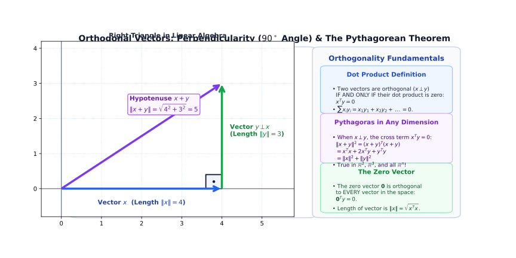
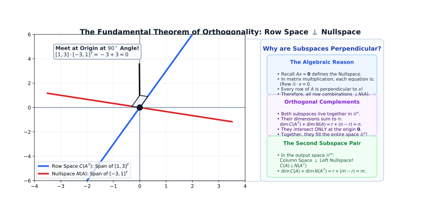
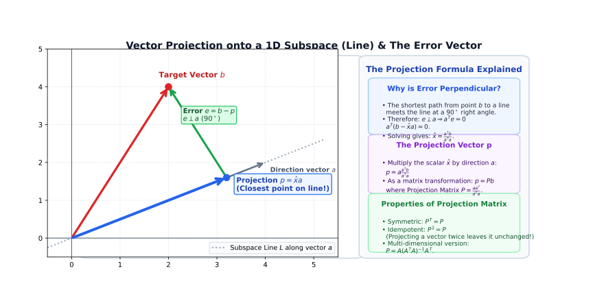
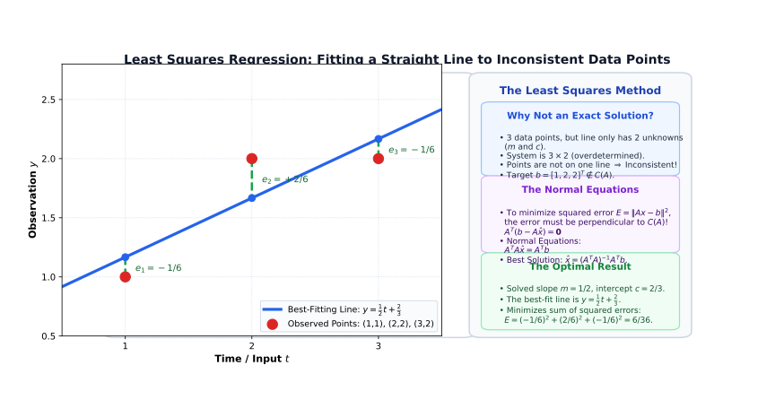
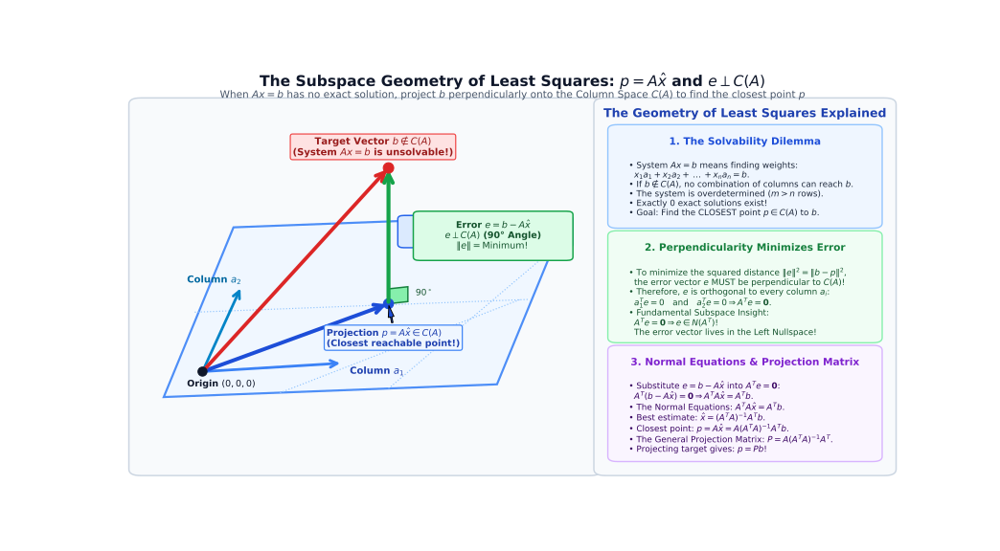
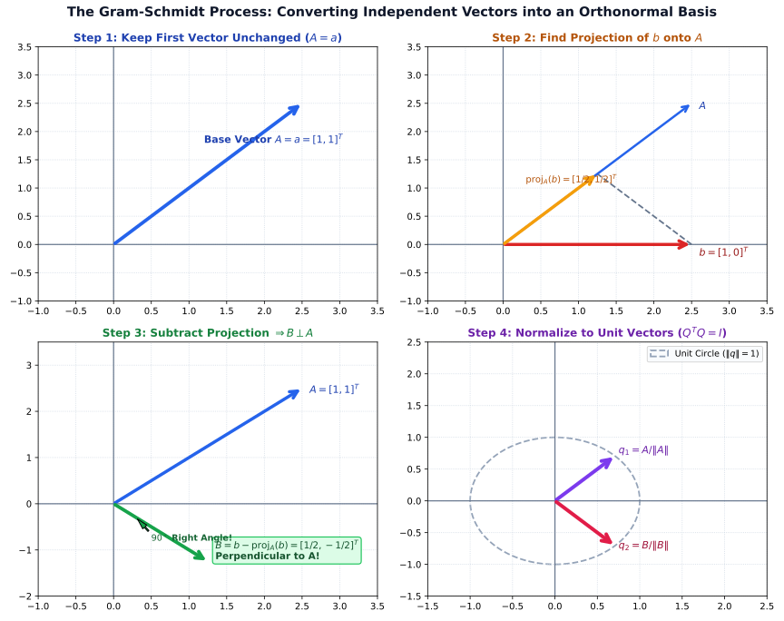

# 📘 Chapter 3: Orthogonality, Projections, Least Squares & Gram-Schmidt

> **Study Guide & Course Notes**  
> A comprehensive, intuitive guide to vector length, dot products, orthogonality, orthogonal subspaces, the fundamental relationship $C(A^T) \perp N(A)$, projection onto lines and planes, projection matrices ($P^T = P, P^2 = P$), least squares approximations, normal equations ($A^TA\hat{x} = A^Tb$), orthonormal bases ($Q^TQ = I$), and the Gram-Schmidt orthogonalization process.

---

## What is This Chapter REALLY About?

The easiest way to understand the whole chapter is:

> **This chapter is about finding directions that are perpendicular (orthogonal) to each other, and finding the closest point/vector to a subspace when an exact solution is impossible.**

The chapter is built on **4 Big Ideas**:

```text
1. Orthogonal
      │
      ▼
   Perpendicular (90° angles, xᵀy = 0)

2. Projection
      │
      ▼
   Finding the closest point on a line or plane

3. Least Squares
      │
      ▼
   Finding the best approximate solution to Ax = b

4. Gram-Schmidt
      │
      ▼
   Turning ordinary independent vectors into
   perpendicular, unit-length (orthonormal) vectors
```

---

## 1. Vector Length (Norm) & The Pythagorean Theorem

You already know the famous **Pythagorean Theorem** for a right triangle:

$$a^2 + b^2 = c^2 \implies c = \sqrt{a^2 + b^2}$$

The exact same geometric principle calculates the **length (norm)** of a vector in linear algebra.

Suppose:

$$x = \begin{bmatrix} 3 \\ 4 \end{bmatrix}$$

The length of $x$ (denoted $\|x\|$ or $|x|$) is:

$$\|x\| = \sqrt{3^2 + 4^2} = \sqrt{9 + 16} = \sqrt{25}$$

$$\boxed{\|x\| = 5}$$

So the vector $\begin{bmatrix} 3 \\ 4 \end{bmatrix}$ has a geometric length of $5$ units.

---

## 2. Vector Length in 3D & General $\mathbb{R}^n$

For a 3D vector:

$$x = \begin{bmatrix} x_1 \\ x_2 \\ x_3 \end{bmatrix}$$

The length formula extends naturally:

$$\boxed{\|x\| = \sqrt{x_1^2 + x_2^2 + x_3^2}}$$

### Example in 3D:
$$x = \begin{bmatrix} 2 \\ 3 \\ 6 \end{bmatrix}$$

$$\|x\| = \sqrt{2^2 + 3^2 + 6^2} = \sqrt{4 + 9 + 36} = \sqrt{49} = 7$$

$$\boxed{\|x\| = 7}$$

In general $n$-dimensional space $\mathbb{R}^n$:

$$\boxed{\|x\| = \sqrt{x_1^2 + x_2^2 + \dots + x_n^2}}$$

---

## 3. What Does $x^Tx$ Mean? (Length Squared)

Recall the **transpose** operation from Chapter 1. If $x$ is an $n \times 1$ column vector:

$$x = \begin{bmatrix} 2 \\ 3 \end{bmatrix}$$

then $x^T$ is a $1 \times n$ row vector:

$$x^T = \begin{bmatrix} 2 & 3 \end{bmatrix}$$

Multiplying the row vector $x^T$ by the column vector $x$:

$$x^T x = \begin{bmatrix} 2 & 3 \end{bmatrix} \begin{bmatrix} 2 \\ 3 \end{bmatrix} = 2(2) + 3(3) = 4 + 9 = 13$$

$$\boxed{x^T x = 13}$$

Notice that $x^T x$ is the sum of the squares of the components! Therefore:

$$\boxed{\|x\|^2 = x^T x \iff \|x\| = \sqrt{x^T x}}$$

> **Key Rule:** Multiplying a vector's transpose by itself ($x^Tx$) computes the **square of its length**.

---

## 4. The Dot Product (Inner Product)

The **dot product** (or **inner product**) of two vectors $x$ and $y$ is written as $x^T y$:

> **Dot Product Rule:** Multiply corresponding numbers from each vector, then add all products together.

Suppose:

$$x = \begin{bmatrix} 2 \\ 3 \end{bmatrix}, \quad y = \begin{bmatrix} 4 \\ 5 \end{bmatrix}$$

Then:

$$x^T y = \begin{bmatrix} 2 & 3 \end{bmatrix} \begin{bmatrix} 4 \\ 5 \end{bmatrix} = 2(4) + 3(5) = 8 + 15 = 23$$

$$\boxed{x^T y = 23}$$

$$\boxed{\text{Dot Product } x^T y = \sum_{i=1}^n x_i y_i}$$

---

## 5. What Does "Orthogonal" Mean? ($x^Ty = 0$) ⭐⭐⭐

**Orthogonal** is the formal mathematical term for **perpendicular** ($90^\circ$ angle).

```text
        y ▲
          │
          │  90° angle
──────────┼──────────► x
          │
```

In linear algebra:

> **Orthogonality Condition:**  
> Two non-zero vectors $x$ and $y$ are **orthogonal** ($x \perp y$) **if and only if** their dot product is strictly zero:

$$\boxed{x \perp y \iff x^T y = 0}$$




---

## 6. How to Check if Two Vectors are Orthogonal

Suppose we have:

$$x = \begin{bmatrix} 2 \\ 2 \\ -1 \end{bmatrix}, \quad y = \begin{bmatrix} -1 \\ 2 \\ 2 \end{bmatrix}$$

Compute the dot product $x^T y$:

$$x^T y = 2(-1) + 2(2) + (-1)(2) = -2 + 4 - 2 = 0$$

$$\boxed{x^T y = 0 \implies x \perp y}$$

Because the dot product is $0$, the vectors are strictly **orthogonal**.

---

### ⭐ Exam Strategy: Testing Orthogonality

When an exam asks: *"Are these vectors orthogonal?"*

1. **Step 1:** Calculate the dot product:
   $$x^T y$$
2. **Step 2:** Check the numerical value:
   - If $x^T y = 0 \implies \boxed{\text{Orthogonal}}$
   - If $x^T y \neq 0 \implies \boxed{\text{NOT Orthogonal}}$

---

## 7. Orthogonality of the Zero Vector

> **Theorem:**  
> The zero vector $\mathbf{0}$ is orthogonal to **every** vector in the space.

### Why?
Because for any vector $y$:

$$\mathbf{0}^T y = 0(y_1) + 0(y_2) + \dots + 0(y_n) = 0$$

$$\boxed{\mathbf{0} \perp y \quad \text{for every vector } y}$$

---

## 8. What is an Orthogonal Subspace?

We can extend orthogonality from individual vectors to entire vector subspaces:

> **Definition:**  
> Two subspaces $V$ and $W$ are **orthogonal** ($V \perp W$) if **every vector** in $V$ is perpendicular to **every vector** in $W$.

```text
Subspace V
    │
    │  90° (Every v ∈ V is perpendicular to every w ∈ W)
    │
Subspace W
```

$$\boxed{v^T w = 0 \quad \text{for all } v \in V, \ w \in W}$$

---

## 9. Fundamental Theorem: Row Space $\perp$ Nullspace ⭐⭐⭐

In Chapter 2, you learned about the **Row Space** $C(A^T)$ and the **Nullspace** $N(A)$.

Chapter 3 reveals their extraordinary geometric relationship:

> **The Fundamental Theorem of Orthogonality:**  
> For any matrix $A$, the **Row Space** is strictly orthogonal to the **Nullspace**:

$$\boxed{C(A^T) \perp N(A)}$$

Both live in $\mathbb{R}^n$, and together they form **orthogonal complements**: their dimensions add up to $n$ ($r + (n - r) = n$), and they intersect only at the zero vector $\mathbf{0}$.




---

## 10. Orthogonality of the Four Fundamental Subspaces

The Four Fundamental Subspaces pair up into two orthogonal complement pairs:

1. **In $\mathbb{R}^n$ (Input space):**
   $$\boxed{C(A^T) \perp N(A)}$$
   *The Row Space is perpendicular to the Nullspace.*

2. **In $\mathbb{R}^m$ (Output space):**
   $$\boxed{C(A) \perp N(A^T)}$$
   *The Column Space is perpendicular to the Left Nullspace.*

---

## 11. Geometric Example: $C(A^T) \perp N(A)$

Let:

$$A = \begin{bmatrix} 
1 & 3 \\ 
2 & 6 \\ 
3 & 9 
\end{bmatrix}$$

Notice that Row 2 is $2 \times (\text{Row 1})$ and Row 3 is $3 \times (\text{Row 1})$.  
The rank is $r = 1$.

- **Row Space $C(A^T)$:** All multiples of $\begin{bmatrix} 1 & 3 \end{bmatrix}$ (a 1D line in $\mathbb{R}^2$).
- **Nullspace $N(A)$:** Vectors satisfying $Ax = \mathbf{0}$, such as $x = \begin{bmatrix} -3 \\ 1 \end{bmatrix}$.

Check their dot product:

$$\begin{bmatrix} 1 & 3 \end{bmatrix} \begin{bmatrix} -3 \\ 1 \end{bmatrix} = 1(-3) + 3(1) = -3 + 3 = 0$$

The row line and the null line intersect at $(0,0)$ at an exact $90^\circ$ right angle.

---

## 12. What is Projection? ⭐⭐⭐⭐⭐

Imagine you have a target vector $b$ and a line (or subspace). You want to find the point on that line that is **closest** to $b$.

That closest point is the **projection** of $b$, denoted $p$:

```text
         b ● (Target vector)
           │
           │  (Shortest path is perpendicular)
           │
         p ● (Projection: closest point on the line)
───────────┼────────────────────────── Line a
```

> **Definition:**  
> The **projection $p$** is the unique vector in the subspace that minimizes the distance $\|b - p\|$ to the target vector $b$.

---

## 13. Why is the Error Perpendicular to the Subspace?

The vector connecting $p$ to $b$ is the **error vector** $e$:

$$\boxed{e = b - p}$$

The shortest distance from any point to a line or plane is along the line that meets it at a **$90^\circ$ right angle**.

Therefore:

$$\boxed{e \perp \text{Subspace} \iff a^T e = 0 \iff a^T (b - p) = 0}$$

This single geometric fact is the foundation for all projection and least-squares formulas!

---

## 14. Projection onto a Line (1D Subspace)

Suppose we want to project vector $b$ onto the line passing through vector $a$.

Because $p$ lies on the line along $a$, it must be a scalar multiple of $a$:

$$p = \hat{x} a$$

Using the perpendicularity condition $a^T(b - \hat{x} a) = 0$:

$$a^T b - \hat{x} a^T a = 0 \implies \hat{x} = \frac{a^T b}{a^T a}$$

Therefore, the projection vector $p$ is:

$$\boxed{p = a \frac{a^T b}{a^T a}}$$




---

## 15. Intuitive Breakdown of the 1D Projection Formula

Do not be intimidated by the notation:

$$p = a \frac{a^T b}{a^T a}$$

Think of it as:

$$\text{Projection } p = (\text{Direction Vector } a) \times (\text{Scaling factor } \hat{x})$$

Where the scalar fraction:

$$\hat{x} = \frac{a^T b}{a^T a} = \frac{\text{dot product of } a \text{ and } b}{\text{length squared of } a}$$

measures how much of vector $b$ points along the direction of vector $a$.

---

## 16. The Projection Matrix for a Line ($P = \frac{aa^T}{a^Ta}$) ⭐⭐⭐⭐

Instead of recomputing the formula each time, we can represent projection as matrix multiplication:

$$p = a \frac{a^T b}{a^T a} = \frac{a a^T}{a^T a} b$$

Define the **Projection Matrix $P$**:

$$\boxed{P = \frac{a a^T}{a^T a}}$$

$$\boxed{p = P b}$$

Multiplying any vector $b$ by matrix $P$ automatically projects $b$ onto the line along $a$.

### Concrete Worked Example:
Let the direction vector be $a = \begin{bmatrix} 1 \\ 2 \end{bmatrix}$ and target vector be $b = \begin{bmatrix} 3 \\ 1 \end{bmatrix}$.

1. **Compute denominator $a^T a$ (scalar length squared):**
   $$a^T a = 1(1) + 2(2) = 1 + 4 = 5$$

2. **Compute numerator $a a^T$ (outer product matrix):**
   $$a a^T = \begin{bmatrix} 1 \\ 2 \end{bmatrix} \begin{bmatrix} 1 & 2 \end{bmatrix} = \begin{bmatrix} 1(1) & 1(2) \\ 2(1) & 2(2) \end{bmatrix} = \begin{bmatrix} 1 & 2 \\ 2 & 4 \end{bmatrix}$$

3. **Form the projection matrix $P$:**
   $$P = \frac{a a^T}{a^T a} = \frac{1}{5} \begin{bmatrix} 1 & 2 \\ 2 & 4 \end{bmatrix} = \begin{bmatrix} 1/5 & 2/5 \\ 2/5 & 4/5 \end{bmatrix}$$

4. **Compute the projection vector $p = Pb$:**
   $$p = \frac{1}{5} \begin{bmatrix} 1 & 2 \\ 2 & 4 \end{bmatrix} \begin{bmatrix} 3 \\ 1 \end{bmatrix} = \frac{1}{5} \begin{bmatrix} 1(3) + 2(1) \\ 2(3) + 4(1) \end{bmatrix} = \frac{1}{5} \begin{bmatrix} 5 \\ 10 \end{bmatrix} = \begin{bmatrix} 1 \\ 2 \end{bmatrix}$$

5. **Compute the error vector $e = b - p$:**
   $$e = \begin{bmatrix} 3 \\ 1 \end{bmatrix} - \begin{bmatrix} 1 \\ 2 \end{bmatrix} = \begin{bmatrix} 2 \\ -1 \end{bmatrix}$$

6. **Verify orthogonality ($a^T e = 0$):**
   $$a^T e = \begin{bmatrix} 1 & 2 \end{bmatrix} \begin{bmatrix} 2 \\ -1 \end{bmatrix} = 1(2) + 2(-1) = 2 - 2 = 0 \quad \checkmark$$

---

## 17. Two Fundamental Properties of Any Projection Matrix

Every legitimate projection matrix $P$ satisfies two vital algebraic properties:

### Property 1: Symmetric
A projection matrix is always symmetric:

$$\boxed{P^T = P}$$

In our example, $\begin{bmatrix} 1/5 & 2/5 \\ 2/5 & 4/5 \end{bmatrix}^T = \begin{bmatrix} 1/5 & 2/5 \\ 2/5 & 4/5 \end{bmatrix}$.

### Property 2: Idempotent (Squaring Doesn't Change It)
Projecting a vector a second time does nothing new, because the vector is already on the subspace:

$$\boxed{P^2 = P}$$

**Check with our numbers:**
$$P^2 = \frac{1}{5} \begin{bmatrix} 1 & 2 \\ 2 & 4 \end{bmatrix} \times \frac{1}{5} \begin{bmatrix} 1 & 2 \\ 2 & 4 \end{bmatrix} = \frac{1}{25} \begin{bmatrix} 1(1) + 2(2) & 1(2) + 2(4) \\ 2(1) + 4(2) & 2(2) + 4(4) \end{bmatrix}$$

$$= \frac{1}{25} \begin{bmatrix} 1 + 4 & 2 + 8 \\ 2 + 8 & 4 + 16 \end{bmatrix} = \frac{1}{25} \begin{bmatrix} 5 & 10 \\ 10 & 20 \end{bmatrix} = \frac{1}{5} \begin{bmatrix} 1 & 2 \\ 2 & 4 \end{bmatrix} = P \quad \checkmark$$

```text
b ──(Project via P)──► p ──(Project again via P)──► p
```

---

## 18. Projection onto Subspaces of Higher Dimension ($P = A(A^TA)^{-1}A^T$)

What if we want to project vector $b$ not just onto a 1D line, but onto a 2D plane or higher-dimensional column space $C(A)$?

If the columns of matrix $A$ span the subspace, the projection matrix generalizes to:

$$\boxed{P = A (A^T A)^{-1} A^T}$$

$$\boxed{p = P b = A (A^T A)^{-1} A^T b}$$

Notice that if $A$ is a single column $a$, this reduces precisely to $\frac{a a^T}{a^T a}$.

---

## 19. Understanding the Matrix $A^TA$

In the formula $P = A(A^TA)^{-1}A^T$, the core block is $A^TA$:
- If $A$ is $m \times n$, then $A^T$ is $n \times m$.
- Therefore, $A^TA$ is always a **square $n \times n$ matrix**.
- $A^TA$ is always **symmetric**: $(A^TA)^T = A^T(A^T)^T = A^TA$.
- $A^TA$ is **invertible** if and only if the columns of $A$ are **linearly independent**.

---

## 20. Why Do We Need Projection? (Inconsistent Systems $Ax = b$)

In real-world applications (engineering, data science, physics), we frequently encounter systems with **more equations than unknowns** ($m > n$, "tall and thin" matrices).

Recall from Chapter 2:
> $Ax = b$ has an exact solution **only if** $b$ lies inside the column space $C(A)$.

When $b \notin C(A)$, there is **no exact solution**.  
Rather than giving up, we find the **closest possible answer** by projecting $b$ onto $C(A)$!

---

## 21. What is Least Squares? ⭐⭐⭐⭐⭐

Suppose you collect experimental data points:

$$(1, 1), \quad (2, 2), \quad (3, 2)$$

You want to find the straight line:

$$y = mt + c$$

that best captures the trend of these points.

```text
  y ▲
    │          • (3, 2)
  2 │     • (2, 2)
    │   • (1, 1)   /  (Best-fitting line)
  1 │             /
    │            /
────┼───┬────┬───┬────► t
    │   1    2   3
```

Because the three points do not lie on a single straight line, no line passes through all of them.  
We want the **best-fitting line** that minimizes the overall error. This method is called **Least Squares**.

---

## 22. Why "Least Squares"?

For each data point, the error (residual) between the observed value $y_i$ and the line's prediction $\hat{y}_i$ is:

$$e_i = y_i - \hat{y}_i$$

We cannot simply minimize the sum of errors $\sum e_i$, because positive and negative errors would cancel out.  
Instead, we minimize the **sum of squared errors**:

$$\boxed{E = e_1^2 + e_2^2 + e_3^2 = \|Ax - b\|^2}$$

Making this squared sum as small as possible is why the method is called **Least Squares**.

---

## 23. The Least-Squares Normal Equations

To minimize the error $\|Ax - b\|^2$, the error vector $e = b - A\hat{x}$ must be perpendicular to the column space $C(A)$:

$$A^T (b - A\hat{x}) = \mathbf{0}$$

$$A^T b - A^T A \hat{x} = \mathbf{0}$$

This yields the world-famous **Normal Equations**:

$$\boxed{A^T A \hat{x} = A^T b}$$

Solving for the best estimate $\hat{x}$:

$$\boxed{\hat{x} = (A^T A)^{-1} A^T b}$$

---

## 24. What is $\hat{x}$?

The notation $\hat{x}$ ("x-hat") represents the **best approximate solution**:
- $x$ would be the exact solution to $Ax = b$ (if one existed).
- $\hat{x}$ is the **optimal least-squares estimate** that makes $A\hat{x}$ as close to $b$ as mathematically possible.

The closest reachable point is the projection:

$$\boxed{p = A \hat{x}}$$

---

## 25. Detailed Least-Squares Example from the Course

Let's find the best-fitting line $y = mt + c$ for:

$$(t_1, y_1) = (1, 1), \quad (t_2, y_2) = (2, 2), \quad (t_3, y_3) = (3, 2)$$

Plugging each point into $mt + c = y$:

$$m(1) + c = 1$$

$$m(2) + c = 2$$

$$m(3) + c = 2$$

In matrix form $Ax = b$:

$$\begin{bmatrix} 
1 & 1 \\ 
2 & 1 \\ 
3 & 1 
\end{bmatrix}
\begin{bmatrix} m \\ c \end{bmatrix}
=
\begin{bmatrix} 1 \\ 2 \\ 2 \end{bmatrix}$$

### Step 1: Compute $A^TA$
$$A^T A = \begin{bmatrix} 1 & 2 & 3 \\ 1 & 1 & 1 \end{bmatrix} \begin{bmatrix} 1 & 1 \\ 2 & 1 \\ 3 & 1 \end{bmatrix}$$

**Middle calculations (Row $\times$ Column):**
* **Entry $(1, 1)$:** $1(1) + 2(2) + 3(3) = 1 + 4 + 9 = 14$
* **Entry $(1, 2)$:** $1(1) + 2(1) + 3(1) = 1 + 2 + 3 = 6$
* **Entry $(2, 1)$:** $1(1) + 1(2) + 1(3) = 1 + 2 + 3 = 6$
* **Entry $(2, 2)$:** $1(1) + 1(1) + 1(1) = 1 + 1 + 1 = 3$

$$A^T A = \begin{bmatrix} 14 & 6 \\ 6 & 3 \end{bmatrix}$$

---

### Step 2: Compute $A^Tb$
$$A^T b = \begin{bmatrix} 1 & 2 & 3 \\ 1 & 1 & 1 \end{bmatrix} \begin{bmatrix} 1 \\ 2 \\ 2 \end{bmatrix}$$

**Middle calculations:**
* **Row 1:** $1(1) + 2(2) + 3(2) = 1 + 4 + 6 = 11$
* **Row 2:** $1(1) + 1(2) + 1(2) = 1 + 2 + 2 = 5$

$$A^T b = \begin{bmatrix} 11 \\ 5 \end{bmatrix}$$

---

### Step 3: Solve the Normal Equations $A^TA\hat{x} = A^Tb$

$$\begin{bmatrix} 14 & 6 \\ 6 & 3 \end{bmatrix} \begin{bmatrix} m \\ c \end{bmatrix} = \begin{bmatrix} 11 \\ 5 \end{bmatrix}$$

This corresponds to the two linear equations:
1. $14m + 6c = 11$
2. $6m + 3c = 5$

**Elimination steps:**
1. Multiply Equation (2) by $2$:
   $$12m + 6c = 10$$
2. Subtract this from Equation (1):
   $$(14m + 6c) - (12m + 6c) = 11 - 10$$
   $$2m = 1 \implies m = \frac{1}{2}$$
3. Substitute $m = \frac{1}{2}$ into Equation (2):
   $$6\left(\frac{1}{2}\right) + 3c = 5$$
   $$3 + 3c = 5 \implies 3c = 2 \implies c = \frac{2}{3}$$

So the optimal parameter vector is:

$$\hat{x} = \begin{bmatrix} m \\ c \end{bmatrix} = \begin{bmatrix} 1/2 \\ 2/3 \end{bmatrix}$$

The best-fitting line is:

$$\boxed{y = \frac{1}{2}t + \frac{2}{3}}$$

---

### Step 4: Compute the Projection $p = A\hat{x}$ and Error $e = b - p$

The closest predicted points on the line are:

$$p = A\hat{x} =
\begin{bmatrix} 1 & 1 \\ 2 & 1 \\ 3 & 1 \end{bmatrix}
\begin{bmatrix} 1/2 \\ 2/3 \end{bmatrix}
=
\begin{bmatrix}
1(1/2) + 2/3 \\
2(1/2) + 2/3 \\
3(1/2) + 2/3
\end{bmatrix}
=
\begin{bmatrix}
7/6 \\
10/6 \\
13/6
\end{bmatrix}$$

The error (vertical residual) at each point is:

$$e = b - p =
\begin{bmatrix} 1 \\ 2 \\ 2 \end{bmatrix}
-
\begin{bmatrix} 7/6 \\ 10/6 \\ 13/6 \end{bmatrix}
=
\begin{bmatrix}
6/6 - 7/6 \\
12/6 - 10/6 \\
12/6 - 13/6
\end{bmatrix}
=
\begin{bmatrix}
-1/6 \\
2/6 \\
-1/6
\end{bmatrix}$$

**Verify orthogonality ($A^T e = \mathbf{0}$):**
* $1(-1/6) + 2(2/6) + 3(-1/6) = -1/6 + 4/6 - 3/6 = 0$
* $1(-1/6) + 1(2/6) + 1(-1/6) = -1/6 + 2/6 - 1/6 = 0$

$$A^T e = \begin{bmatrix} 0 \\ 0 \end{bmatrix} \quad \checkmark$$

The error vector is strictly perpendicular to the column space!




---

## 26. Geometry of the Error Vector ($e \perp C(A)$)

The error vector is:

$$\boxed{e = b - p = b - A\hat{x}}$$

> **Fundamental Geometric Theorem:**  
> The error vector $e$ is **strictly perpendicular to the column space** $C(A)$:

$$\boxed{e \perp C(A) \iff A^T e = \mathbf{0}}$$

Because $A^T e = \mathbf{0}$, the error vector $e$ lives inside the **Left Nullspace** $N(A^T)$!

---

## 27. Visual Diagram of Least Squares

```text
               b ● (Observed data vector, not in C(A))
                 │
                 │
        Error e  │ (Perpendicular to C(A))
        = b - p  │
                 │
               p ● (Closest point = A x̂ = Pb)
              /
             /
            /
─────────────────────────── Column Space C(A)
```

- $b$ = actual data vector
- $p = A\hat{x}$ = projection of $b$ onto $C(A)$
- $e = b - p$ = perpendicular error vector




---

## 28. Invertibility of $A^TA$ When Columns are Independent

> **Theorem:**  
> $A^TA$ is invertible **if and only if** matrix $A$ has **linearly independent columns** (full column rank, $r = n$).

This guarantees that the normal equations $A^TA\hat{x} = A^Tb$ always have a **unique solution** $\hat{x} = (A^TA)^{-1}A^Tb$ whenever the columns of $A$ are independent.

---

## 29. What is an Orthogonal Basis? ⭐⭐⭐

Recall from Chapter 2 that a **basis** consists of linearly independent vectors that span a space.

An **orthogonal basis** adds one powerful condition:

> **Orthogonal Basis:** A basis where every vector is **perpendicular** to every other vector in the basis.

$$\boxed{v_i^T v_j = 0 \quad \text{for all } i \neq j}$$

---

## 30. Example of an Orthogonal Basis

In $\mathbb{R}^2$:

$$q_1 = \begin{bmatrix} 1 \\ 0 \end{bmatrix}, \quad q_2 = \begin{bmatrix} 0 \\ 1 \end{bmatrix}$$

Check:

$$q_1^T q_2 = 1(0) + 0(1) = 0$$

They are independent, span $\mathbb{R}^2$, and are perpendicular. Hence, they form an **orthogonal basis**.

---

## 31. What is an Orthonormal Basis? (Orthogonal + Unit Length)

An **orthonormal basis** is the gold standard of coordinate systems:

> **Orthonormal = Orthogonal + Unit Length ($1$)**

1. Every vector is perpendicular to every other vector ($q_i \perp q_j$ for $i \neq j$).
2. Every vector has a length of exactly $1$ ($\|q_i\| = 1 \iff q_i^T q_i = 1$).

$$\boxed{q_i^T q_j = \begin{cases} 0 & \text{if } i \neq j \\ 1 & \text{if } i = j \end{cases}}$$

---

## 32. Orthonormal Condition: $Q^TQ = I$

When we arrange orthonormal vectors $q_1, q_2, \dots, q_n$ as columns of a matrix $Q$:

$$Q = \begin{bmatrix} q_1 & q_2 & \dots & q_n \end{bmatrix}$$

Computing $Q^T Q$:

$$Q^T Q = \begin{bmatrix} 
q_1^T q_1 & q_1^T q_2 & \dots \\ 
q_2^T q_1 & q_2^T q_2 & \dots \\ 
\vdots & \vdots & \ddots 
\end{bmatrix}
=
\begin{bmatrix} 
1 & 0 & \dots & 0 \\ 
0 & 1 & \dots & 0 \\ 
\vdots & \vdots & \ddots & \vdots \\ 
0 & 0 & \dots & 1 
\end{bmatrix}
= I$$

$$\boxed{Q^T Q = I}$$

---

## 33. Properties of Orthonormal Matrices ($Q$)

A matrix $Q$ with orthonormal columns is called an **orthonormal matrix** (or an **orthogonal matrix** if square).

If $Q$ is square ($n \times n$):

$$Q^T Q = I \implies \boxed{Q^{-1} = Q^T}$$

---

## 34. Memory Trick: For Square $Q$, Inverse = Transpose

For general matrices, calculating $A^{-1}$ requires extensive Gaussian elimination or Gauss-Jordan row operations.

For square orthonormal matrices:

$$\boxed{Q^{-1} = Q^T}$$

> **Exam Takeaway:** Finding the inverse of an orthonormal matrix requires **zero calculations**—simply take its transpose!

---

## 35. Simplified Projection Formula: $P = QQ^T$

Recall the general projection matrix:

$$P = A(A^T A)^{-1} A^T$$

If we replace $A$ with an orthonormal matrix $Q$:

$$P = Q(Q^T Q)^{-1} Q^T$$

Because $Q^T Q = I$:

$$(Q^T Q)^{-1} = I^{-1} = I$$

The formula dramatically collapses to:

$$\boxed{P = Q Q^T}$$

Projection calculations become vastly faster and numerically stable when using orthonormal bases.

---

## 36. The Gram-Schmidt Process ⭐⭐⭐⭐⭐

What if you have ordinary, messy independent vectors that are NOT perpendicular?

The **Gram-Schmidt process** is the algorithm that converts them into neat, perpendicular, unit-length vectors:

```text
Original independent vectors {a, b, c, ...}
                   │
                   ▼
         Gram-Schmidt Process
  (Subtract projections onto earlier vectors)
                   │
                   ▼
         Orthogonal vectors {A, B, C, ...}
                   │
                   ▼
          Normalize (divide by length)
                   │
                   ▼
        Orthonormal vectors {q₁, q₂, q₃, ...}
```

---

## 37. Gram-Schmidt Algorithm for Two Vectors

Given two independent vectors $a$ and $b$:

### Step 1: Keep the first vector
$$A = a$$

### Step 2: Subtract from $b$ its projection along $A$
$$\operatorname{proj}_A(b) = A \frac{A^T b}{A^T A}$$

$$B = b - \operatorname{proj}_A(b)$$

$$\boxed{B = b - A \frac{A^T b}{A^T A}}$$

Vector $B$ is now guaranteed to be strictly perpendicular to $A$ ($A \perp B$).

---

## 38. Geometric Intuition: Subtracting the Parallel Component

Vector $b$ can be split into two components:
1. The component **parallel** to $A$ ($\operatorname{proj}_A(b)$)
2. The component **perpendicular** to $A$ ($B$)

```text
         b ●
          /│
         / │
        /  │ B (Perpendicular component = b - proj_A(b))
       /   │
      /    │
─────┼─────┴────────────────► A
    (0,0)  proj_A(b) (Parallel component)
```

By subtracting the parallel projection from $b$, what remains ($B$) is purely perpendicular to $A$!




---

## 39. Normalizing to Unit Vectors ($q_1, q_2$)

Once we have the orthogonal vectors $A$ and $B$, we divide each by its length to make them unit vectors:

$$\boxed{q_1 = \frac{A}{\|A\|}}$$

$$\boxed{q_2 = \frac{B}{\|B\|}}$$

The resulting set $\{q_1, q_2\}$ is an **orthonormal basis**.

---

## 40. Step-by-Step Gram-Schmidt Example in $\mathbb{R}^2$

Let:

$$a = \begin{bmatrix} 1 \\ 1 \end{bmatrix}, \quad b = \begin{bmatrix} 1 \\ 0 \end{bmatrix}$$

Notice $a^T b = 1(1) + 1(0) = 1 \neq 0$ (they are not perpendicular).

### Step 1: Set $A = a$
$$A = \begin{bmatrix} 1 \\ 1 \end{bmatrix}$$

### Step 2: Compute Projection of $b$ onto $A$
$$A^T b = \begin{bmatrix} 1 & 1 \end{bmatrix} \begin{bmatrix} 1 \\ 0 \end{bmatrix} = 1$$

$$A^T A = 1^2 + 1^2 = 2$$

$$\operatorname{proj}_A(b) = A \frac{A^T b}{A^T A} = \begin{bmatrix} 1 \\ 1 \end{bmatrix} \frac{1}{2} = \begin{bmatrix} 1/2 \\ 1/2 \end{bmatrix}$$

### Step 3: Compute Perpendicular Vector $B$
$$B = b - \operatorname{proj}_A(b) = \begin{bmatrix} 1 \\ 0 \end{bmatrix} - \begin{bmatrix} 1/2 \\ 1/2 \end{bmatrix} = \begin{bmatrix} 1/2 \\ -1/2 \end{bmatrix}$$

**Check orthogonality:**

$$A^T B = 1\left(\frac{1}{2}\right) + 1\left(-\frac{1}{2}\right) = 0 \quad \checkmark$$

### Step 4: Normalize $A$ and $B$
$$\|A\| = \sqrt{1^2 + 1^2} = \sqrt{2} \implies q_1 = \frac{1}{\sqrt{2}} \begin{bmatrix} 1 \\ 1 \end{bmatrix}$$

$$\|B\| = \sqrt{\left(\frac{1}{2}\right)^2 + \left(-\frac{1}{2}\right)^2} = \sqrt{\frac{1}{2}} = \frac{1}{\sqrt{2}} \implies q_2 = \frac{B}{\|B\|} = \frac{1}{\sqrt{2}} \begin{bmatrix} 1 \\ -1 \end{bmatrix}$$

$$\boxed{q_1 = \frac{1}{\sqrt{2}} \begin{bmatrix} 1 \\ 1 \end{bmatrix}, \quad q_2 = \frac{1}{\sqrt{2}} \begin{bmatrix} 1 \\ -1 \end{bmatrix}}$$

---

## 41. Gram-Schmidt for 3 Vectors

If given three independent vectors $a, b, c$:

1. **First Vector:**
   $$A = a$$
2. **Second Vector:** Subtract projection onto $A$:
   $$B = b - \frac{A^T b}{A^T A} A$$
3. **Third Vector:** Subtract projections onto **both** $A$ and $B$:
   $$\boxed{C = c - \frac{A^T c}{A^T A} A - \frac{B^T c}{B^T B} B}$$

Finally, normalize each vector:

$$q_1 = \frac{A}{\|A\|}, \quad q_2 = \frac{B}{\|B\|}, \quad q_3 = \frac{C}{\|C\|}$$

### Worked 3D Numerical Example:

Let:
$$a = \begin{bmatrix} 1 \\ 0 \\ 0 \end{bmatrix}, \quad b = \begin{bmatrix} 1 \\ 1 \\ 0 \end{bmatrix}, \quad c = \begin{bmatrix} 1 \\ 1 \\ 1 \end{bmatrix}$$

#### Step 1: Set $A = a$
$$A = \begin{bmatrix} 1 \\ 0 \\ 0 \end{bmatrix}$$

#### Step 2: Calculate $B \perp A$
* $A^T b = 1(1) + 0(1) + 0(0) = 1$
* $A^T A = 1^2 + 0^2 + 0^2 = 1$
* Projection of $b$ along $A$: $\frac{A^T b}{A^T A} A = \frac{1}{1}\begin{bmatrix} 1 \\ 0 \\ 0 \end{bmatrix} = \begin{bmatrix} 1 \\ 0 \\ 0 \end{bmatrix}$

$$B = b - \begin{bmatrix} 1 \\ 0 \\ 0 \end{bmatrix} = \begin{bmatrix} 1 \\ 1 \\ 0 \end{bmatrix} - \begin{bmatrix} 1 \\ 0 \\ 0 \end{bmatrix} = \begin{bmatrix} 0 \\ 1 \\ 0 \end{bmatrix}$$

**Check:** $A^T B = 1(0) + 0(1) + 0(0) = 0 \quad \checkmark$

#### Step 3: Calculate $C \perp A$ and $C \perp B$
* $A^T c = 1(1) + 0(1) + 0(1) = 1$
* $B^T c = 0(1) + 1(1) + 0(1) = 1$
* $B^T B = 0^2 + 1^2 + 0^2 = 1$

Subtract both parallel projections from $c$:

$$C = c - \frac{A^T c}{A^T A} A - \frac{B^T c}{B^T B} B = \begin{bmatrix} 1 \\ 1 \\ 1 \end{bmatrix} - \frac{1}{1}\begin{bmatrix} 1 \\ 0 \\ 0 \end{bmatrix} - \frac{1}{1}\begin{bmatrix} 0 \\ 1 \\ 0 \end{bmatrix}$$

$$C = \begin{bmatrix} 1 - 1 - 0 \\ 1 - 0 - 1 \\ 1 - 0 - 0 \end{bmatrix} = \begin{bmatrix} 0 \\ 0 \\ 1 \end{bmatrix}$$

**Check:**
* $A^T C = 1(0) + 0(0) + 0(1) = 0 \quad \checkmark$
* $B^T C = 0(0) + 1(0) + 0(1) = 0 \quad \checkmark$

#### Step 4: Normalize
Since $\|A\| = 1$, $\|B\| = 1$, and $\|C\| = 1$, they are already unit length:

$$\boxed{q_1 = \begin{bmatrix} 1 \\ 0 \\ 0 \end{bmatrix}, \quad q_2 = \begin{bmatrix} 0 \\ 1 \\ 0 \end{bmatrix}, \quad q_3 = \begin{bmatrix} 0 \\ 0 \\ 1 \end{bmatrix}}$$

The vectors $q_1, q_2, q_3$ form an orthonormal basis for $\mathbb{R}^3$.

---

## 🧠 Concept Map: Chapter 3 in One Picture

```text
                     VECTOR
                       │
                       ▼
                 VECTOR LENGTH
                   ||x|| = √(xᵀx)
                       │
                       ▼
                  DOT PRODUCT
                     xᵀy
                       │
                       ▼
                  ORTHOGONAL
                Perpendicular (xᵀy = 0)
                       │
                       ▼
             ORTHOGONAL SUBSPACES
             Row Space ⊥ Nullspace
               C(Aᵀ) ⊥ N(A)
                       │
                       ▼
                  PROJECTION
            Closest point on a subspace
               p = Pb,  P = A(AᵀA)⁻¹Aᵀ
                       │
                       ▼
                 LEAST SQUARES
          Best approximation to Ax = b
            Normal Eq: AᵀAx̂ = Aᵀb
                       │
                       ▼
               ORTHOGONAL BASIS
             Mutually perpendicular
                       │
                       ▼
              ORTHONORMAL BASIS
           Perpendicular + Unit Length
                  QᵀQ = I
                       │
                       ▼
                GRAM-SCHMIDT
          Transform independent vectors
             into orthonormal vectors
```

---

## ⭐ Exam Review: Key Formulas Cheat Sheet

| # | Concept | Formula | Meaning / Notes |
| :---: | :--- | :--- | :--- |
| **1** | **Vector Length** | $\|x\| = \sqrt{x^Tx} = \sqrt{\sum x_i^2}$ | Distance from origin to vector tip |
| **2** | **Dot Product** | $x^Ty = \sum x_i y_i$ | Inner product of two vectors |
| **3** | **Orthogonality** | $\mathbf{x^Ty = 0 \iff x \perp y}$ | $90^\circ$ perpendicular angle |
| **4** | **Subspace Orthogonality** | $\mathbf{C(A^T) \perp N(A)}$ | Row Space $\perp$ Nullspace |
| **5** | **Left Subspace Orthogonality** | $\mathbf{C(A) \perp N(A^T)}$ | Column Space $\perp$ Left Nullspace |
| **6** | **Projection onto a Line** | $p = a \frac{a^Tb}{a^Ta}$ | Closest point on line $a$ to vector $b$ |
| **7** | **Projection Matrix (Line)** | $P = \frac{aa^T}{a^Ta}$ | Matrix that projects any vector onto line $a$ |
| **8** | **General Projection Matrix** | $\mathbf{P = A(A^TA)^{-1}A^T}$ | Projects onto Column Space $C(A)$ |
| **9** | **Projection Properties** | $\mathbf{P^T = P \quad \text{and} \quad P^2 = P}$ | Symmetric and idempotent |
| **10** | **Normal Equations** | $\mathbf{A^TA\hat{x} = A^Tb}$ | Core system for least-squares fitting |
| **11** | **Least-Squares Solution** | $\mathbf{\hat{x} = (A^TA)^{-1}A^Tb}$ | Minimizes error $\|Ax - b\|^2$ |
| **12** | **Orthonormal Matrix** | $\mathbf{Q^TQ = I}$ | Columns are orthonormal |
| **13** | **Square Orthogonal Matrix** | $\mathbf{Q^{-1} = Q^T}$ | Inverse is simply the transpose |
| **14** | **Gram-Schmidt Step 2** | $B = b - \frac{A^Tb}{A^TA}A$ | Strips away parallel projection |

---

## 🎯 5-Level Study Roadmap for Beginners

Study the chapter in this structured progression:

- 🟢 **Level 1 — Foundations:**
  1. Vector length ($\|x\| = \sqrt{x^Tx}$)
  2. Dot product ($x^Ty$)
  3. Transpose mechanics
- 🟡 **Level 2 — Orthogonality:**
  4. Orthogonal condition ($x^Ty = 0$)
  5. Fundamental theorem: $C(A^T) \perp N(A)$
- 🟠 **Level 3 — Projections:**
  6. 1D Projection formula ($p = a \frac{a^Tb}{a^Ta}$)
  7. Projection matrix properties ($P^T = P, P^2 = P$)
  8. Error vector perpendicularity ($e \perp C(A)$)
- 🔴 **Level 4 — High-Yield Exam Material:**
  9. Least squares concept (minimizing squared errors)
  10. Setting up and solving the Normal Equations ($A^TA\hat{x} = A^Tb$)
  11. Best-fitting regression line ($y = mt + c$)
- 🟣 **Level 5 — Advanced Synthesis:**
  12. Orthonormal bases and matrices ($Q^TQ = I, Q^{-1} = Q^T$)
  13. Simplified projection ($P = QQ^T$)
  14. Gram-Schmidt orthogonalization process

---

## 🧠 Core Summary: 4 Big Takeaways

> 1. **Dot product tests perpendicularity:**  
>    $x^Ty = 0 \iff x \perp y$
>
> 2. **Projection finds the closest point:**  
>    $p = Pb$, with error $e = b - p$ perpendicular to the subspace.
>
> 3. **Least squares finds the best approximate solution:**  
>    Solve $A^TA\hat{x} = A^Tb$ when $Ax = b$ has no exact solution.
>
> 4. **Gram-Schmidt manufactures orthonormal vectors:**  
>    Independent vectors $\longrightarrow$ Subtract parallel projections $\longrightarrow$ Normalize lengths to $1$.

---

## ⭐ Synthesis: Connecting Chapters 1, 2, and 3

The three chapters form a cohesive mathematical arc:

- **Chapter 1 (Calculation & Operations):**  
  How to compute with matrices $\longrightarrow$ Gaussian elimination, matrix multiplication, pivots, inverses $A^{-1}$, $LU$ factorization, and transposes $A^T$.

- **Chapter 2 (Structure & Spaces):**  
  What matrices and vectors mean geometrically $\longrightarrow$ Vector spaces, subspaces, Column Space $C(A)$, Nullspace $N(A)$, Rank $r$, Free Variables, Basis, and Dimension.

- **Chapter 3 (Geometry & Optimization):**  
  How vector spaces interact geometrically $\longrightarrow$ Orthogonality ($90^\circ$ angles), Row Space $\perp$ Nullspace, projections onto subspaces, optimal least-squares approximations, and orthonormal bases via Gram-Schmidt.
