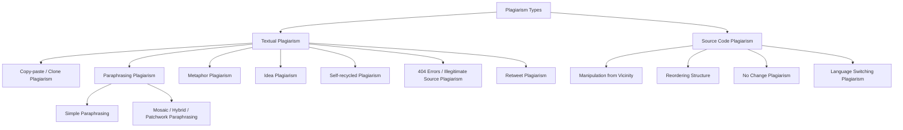

This PDF is about **understanding what plagiarism is, the different forms it takes in text and source code, how it is detected, the severe ethical and professional consequences it brings, and how researchers can strictly avoid it through proper referencing, permissions, and ethical writing**.

---

# Slide 1 — Title

### **Understanding and Avoiding Plagiarism**

**Simple meaning:**  
This presentation is an essential guide on:
- What plagiarism actually means in academic and scientific research.
- The different types of textual and code plagiarism.
- How universities, journals, and conferences detect copied material.
- The penalties and consequences of committing plagiarism.
- The exact rules you must follow to properly cite, quote, and reference other people's work.

---

# Slide 2 — Digital Text: Easy Copying, Easy Plagiarism, Easy Detection

### **Digital Text: Easy Copying, Easy Plagiarism, Easy Detection**

The slide highlights the reality of modern digital research:

- **Abundance of digital content**: Huge amounts of research papers, articles, code, and books are readily available on the internet.
- **Searchable nature of digital text**: Because content is digitized, searching, comparing, and indexing documents is very fast and automated.
- **Easy to copy, easy to detect**: While the internet makes it tempting and effortless to copy, it makes uncredited copying **just as easy to detect**.
- **Steady increase since 2005**: Reported incidents of plagiarism have grown continuously over the years as automated detection tools became standard in publishing.

### Definition of Plagiarism:
> **Reuse of someone’s prior processes, results, or words without explicitly acknowledging the original author or source.**

> [!WARNING]
> **Plagiarism in any form, at any level, is unacceptable.** It is considered a serious breach of professional conduct, with potentially severe ethical and legal consequences.

---

# Slide 3 — Measuring Plagiarism

### **Measuring Plagiarism**

Is there an acceptable threshold or standard measurement for plagiarism?

- **Plagiarism is plagiarism**: There is no "safe" or "acceptable" percentage that is allowed without attribution.
- **Degrees of plagiarism**: While copying anything without credit is plagiarism, the *degree* or extent can vary:
  - Inappropriately reusing an **entire article**.
  - Reusing a **section of an article**.
  - Reusing a **single page**.
  - Reusing a **paragraph**.
  - Reusing **just a single sentence**.
- **Improper paraphrasing**: Even if you change the words around, if it is done improperly or without credit, it is still considered plagiarism.

🌟⭐  
**Simple meaning:**  
You cannot say, *"I only copied one sentence, so it doesn't count."* Copying one sentence without attribution is still plagiarism. The volume copied only affects the severity of your punishment, not whether you cheated or not.

---

# Slide 4 — Plagiarism: Definition

### **Plagiarism: Definition**

Plagiarism is formally defined as:
> **The appropriation of the ideas, words, process, or results of another person without proper acknowledgment, credit, or citation.**

Plagiarism can appear in a research article or computer program in the following 5 ways:

1. **Claiming another person’s work as your own**: Directly pretending someone else's findings, equations, or writing were created by you.
2. **Use of another person’s work without giving credit**: Using someone else's text, data, or algorithm without naming them or providing a citation.
3. **Taking the majority of someone's contribution as your own (whether credit is given or not)**: Even if you put a citation, if 80% of your paper is someone else's content, you have not done original research.
4. **Restructuring other works and claiming as your own**: Rewording, shifting paragraphs around, or disguising another author's paper and claiming it is your original study.
5. **Providing wrong acknowledgment of other works in your work**: Giving false references, referencing the wrong paper, or inventing citations to mislead the reader.

---

# Slide 5 — Using the Archive: No Exceptions to the Rule

### **Using the Archive: No Exceptions to the Rule**

- **Nature of scientific writing**: Scientific and technical research is built directly upon the existing scientific "archive" (previously published literature).
- **Need for validation**: Every new paper references seminal (groundbreaking) past work to authenticate and validate its own experiments.
- **A common misconception/excuse**:
  - Some researchers ask: *"Since scientific papers rely so heavily on existing literature, shouldn't there be exceptions to plagiarism rules?"*
  - Some authors argue that because technical writing is informative and not poetic/literary, it should be acceptable to reuse a *"certain amount"* of someone else's text without exact demarcation, especially if the source is cited somewhere in the bibliography.

---

# Slide 6 — Using the Archive: No Exceptions to the Rule (cont.)

### **Using the Archive: No Exceptions to the Rule (cont.)**

- **Another flawed argument**:
  - Some authors claim: *"Putting quotation marks or indented blocks everywhere breaks the flow of reading and disturbs comprehension in a technical paper."*
- **The absolute answer**:
  > **There are NO valid exceptions to plagiarism.**

🌟⭐  
**Simple meaning:**  
Scientific papers must be just as honest as any other literature. You cannot copy-paste technical definitions or methodology descriptions from another author's paper under the excuse that *"it's just technical writing"* or *"quotations look ugly."*

---

# Slide 7 — Types of Plagiarism

### **Types of Plagiarism**

Plagiarism in scientific and engineering domains typically falls into two major classes:

1. **Textual plagiarism**: Plagiarism occurring in written human language (sentences, explanations, abstracts, conclusions).
2. **Source code plagiarism**: Plagiarism occurring in computer programs, algorithms, scripts, or software implementations.

---

# Slide 8 — Examples of Textual and Source Code Plagiarism

### **Figure 1: Examples of (a) Textual and (b) Source Code Plagiarism**

This slide provides concrete side-by-side examples:

### (a) Textual Plagiarism Example (Superficial Voice Flipping):
- **Original sentence (Active voice):**  
  > *"The nearest-neighbour based outlier mining technique is able to detect a plagiarized text segment."*
- **Plagiarized sentence (Passive voice rewrite):**  
  > *"A plagiarized text segment is detected by the nearest-neighbour based outlier mining technique."*

**Why this is plagiarism:** Simply converting active voice to passive voice without citation or original thought is still plagiarism.

---

### (b) Source Code Plagiarism Example (Cosmetic Renaming):
- **Original Code:**
  ```text
  Data: First, Last
  Result: Sum
  while (Last != 0) do
      Sum = First * Last;
      Last = Last - 1;
  end
  ```
- **Plagiarized Code:**
  ```text
  Data: Start, Finish
  Result: Total
  while (Finish != 0) do
      Total = Start * Finish;
      Finish = Finish - 1;
  end
  ```

**Why this is plagiarism:** The logic, algorithm, and control structure are identical. The developer only renamed `First` → `Start`, `Last` → `Finish`, and `Sum` → `Total`. This is disguised code theft.

---

# Slide 9 — Taxonomy Hierarchy of Plagiarism Types

### **Plagiarism Types Hierarchy**



---

# Slide 10 — Types of Plagiarism: Language Dimension

### **Monolingual vs. Cross-Lingual Plagiarism**

Plagiarism can occur across the same language or across different languages:

- **Monolingual Plagiarism**: Occurs in **homogeneous (identical) language settings**.  
  - *Example:* Copying text from an English journal article into your English paper.
- **Cross-Lingual Plagiarism**: Occurs in **heterogeneous (different) language settings**.  
  - *Example:* Taking a research paper written in Chinese, French, or German, translating it into English, and publishing it without citing the original paper.

🌟⭐  
**Simple meaning:**  
Translating someone else's foreign-language paper into English does **not** make it your original work. Plagiarism detection algorithms and multilingual checkers can now detect cross-lingual translation theft.

---

# Slide 11 — Textual Plagiarism (Part 1)

### **Textual Plagiarism: Categories 1 & 2**

Textual plagiarism is divided into seven subcategories. This slide explains the first two:

### 1. Deliberate Copy-Paste / Clone Plagiarism
- Copying text word-for-word from another work and presenting it as your own.
- May occur with or without acknowledging the original source (even if you mention the source at the end, copying verbatim without quotation marks is clone plagiarism).

### 2. Paraphrasing Plagiarism
Occurs when someone takes another's words/ideas and tries to disguise them. It takes two forms:
- **Simple Paraphrasing**: Using someone else's idea or text, but altering words with basic synonyms, changing active to passive voice, or slightly modifying grammatical structure.
- **Mosaic / Hybrid / Patchwork Paraphrasing**: Combining copied pieces from multiple different research papers into one paragraph, changing word patterns and synonyms across them, but failing to cite the original authors.

---

# Slide 12 — Textual Plagiarism (Part 2)

### **Textual Plagiarism: Categories 3 through 7**

### 3. Metaphor Plagiarism
- Reusing creative metaphors, analogies, or descriptive illustrations devised by another author to explain a complex idea without citing them.

### 4. Idea Plagiarism
- Stealing someone else’s unique hypothesis, methodology, conceptual solution, or research design and presenting it as your own idea in a paper.

### 5. Self / Recycled Plagiarism (Self-Plagiarism)
- Reusing significant portions of your own previously published papers or conference articles in a new submission without proper citation or editor disclosure.
- *Simple meaning:* You cannot "re-sell" the same work twice to get more publication credits.

### 6. 404 Error / Illegitimate Source Plagiarism
- Providing inaccurate, broken, fabricated, or non-existent citations (fake URLs, nonexistent page numbers, bogus authors) to hide copied material or falsely bolster claims.

### 7. Retweet Plagiarism
- The author cites the real source, but their wording, sentence sequence, and grammatical style mimic the original source too closely without quotation marks.

---

# Slide 13 — Source Code Plagiarism

### **Source Code Plagiarism**

Software and code plagiarism can be categorized into four subtypes:

1. **Manipulation from Vicinity Plagiarism**:
   - Taking someone's existing program and making minor localized tweaks: inserting redundant variables, deleting non-essential lines, or substituting operators/functions while keeping the core algorithm identical.
2. **Reordering Structure Plagiarism**:
   - Rearranging the order of independent functions, shifting conditional blocks, or swapping loop types (e.g., changing `for` loop to `while` loop) without referencing the original codebase.
3. **No Change Plagiarism**:
   - Taking someone else's program code and merely altering whitespace, blank lines, indentation, or comments/variable annotations, claiming the program is original.
4. **Language Switching Plagiarism**:
   - Taking an algorithm or program written in one programming language (e.g., C++ or Java) and directly translating it line-by-line into another language (e.g., Python or C#) without crediting the original developer.

---

# Slide 14 — How to Avoid Committing Plagiarism (Core Rules)

### **How to Avoid Committing Plagiarism**

If Author A wants to use text, charts, figures, photographs, or graphics from Author B's work, Author A must do **two mandatory things**:

1. **Clearly indicate the reused material**:
   - Use **quotation marks** for short quotes or **indented block text** for long quotes.
   - Provide a **full reference citation** (author name, paper title, journal/conference name, year, volume, pages).
2. **Obtain written permission**:
   - Obtain formal written permission from the publisher (or copyright holder).
   - If the material is unpublished, obtain written permission directly from the original author.

---

# Slide 15 — How to Avoid Committing Plagiarism: Quantity vs. Definition

### **Amount or Quantity Does NOT Define Plagiarism**

- **Golden Rule**: **"Plagiarism is plagiarism."**
- Whether you steal 5 paragraphs or 1 sentence, the act of plagiarism is established. Quantity does **not** determine whether plagiarism took place.
- **Where quantity DOES matter**:
  - The amount and proportion of copied content plays an important role in determining the **appropriate penalties** (e.g., minor correction warning vs. outright paper rejection vs. formal academic expulsion).

---

# Slide 16 — How to Avoid Committing Plagiarism: Common Pitfalls

### **Three Major Misconceptions About Avoiding Plagiarism**

1. **A reference alone is not enough**: Merely putting a citation at the end of the paragraph is **not sufficient** if you copied the exact words. You must also use quotation marks or block indentation.
2. **Superficial paraphrasing is still plagiarism**: Rearranging a few words, switching sentence clauses, or swapping words with synonyms is improper paraphrasing and will be flagged as plagiarism.
3. **Good paraphrasing without citation is still plagiarism**: Even if you rewrite an idea completely in your own words, if the core idea originated from another paper and you fail to cite it, it is idea plagiarism.

---

# Slide 17 — A Quick Review

### **A Quick Review of Core Principles**

- **Zero tolerance**: Plagiarism in any form, at any level, is unacceptable and constitutes a serious violation of professional and ethical conduct.
- **Intent does not excuse it**: Whether done deliberately (by choice) or accidentally (by mistake), **it is still plagiarism**.
- **Denying credit**: Copying someone else's work robs the original researchers of recognition for their hard work and dedication.
- **Legal liability**: Plagiarism is often also **copyright infringement**, exposing the offending author and institution to legal action and financial lawsuits.

---

# Slide 18 — Approach to Combat Plagiarism

### **Approach to Combat Plagiarism**

This transition slide introduces the systematic mechanisms used by academic publishers, journals, and universities to fight plagiarism.

---

# Slide 19 — A Two-Pronged Approach

### **A Two-Pronged Approach**

Publishers and academic bodies fight plagiarism through two coordinated stages:

1. **Early Detection (Before Publication)**:
   - Detecting copied material at the earliest possible stage—when the manuscript is first submitted for review.
2. **Plagiarism Resolution (After Publication)**:
   - Investigating and resolving allegations when plagiarism is discovered in an article that has already been published.
   - Publishers collaborate with other publishing houses to address copyright violations across journals.

---

# Slide 20 — The First Approach: Plagiarism Detection

### **How Plagiarism is Detected Early**

Early detection relies on three lines of defense:

1. **Automated Similarity Check**:
   - When a paper is submitted, editors use CrossRef’s **Similarity Check Service (powered by iThenticate/CrossCheck)** to compare the manuscript against millions of indexed academic publications.
2. **Peer Reviewers and Editors**:
   - Human reviewers who are experts in the field often recognize familiar equations, text, or figures during the initial review phase.
3. **Alert Readers and Authors**:
   - Readers, researchers, and original authors often notice stolen work and report it directly to the journal editors.

---

# Slide 21 — The Second Approach: Plagiarism Resolution

### **Plagiarism Resolution and Penalties**

When an allegation of plagiarism is raised against an article:

- **Formal Review**: The journal editor or conference chair initiates a formal investigation.
- **Severity-based Penalties**: If serious plagiarism is verified, severe sanctions are applied.
- **Prohibited Author List (PAL)**:
  - If inappropriate reuse is confirmed, the offending author's name and email address are added to a **Prohibited Author List (PAL)** / Blacklist.
  - This list is shared with all journal editors across the publishing organization.

---

# Slide 22 — Consequences of Being on the PAL (Blacklist)

### **Consequences for Blacklisted Authors**

- **Immediate Rejection**: Whenever a banned author submits any new paper, the submission system identifies them and their article is **straightaway rejected** without review.
- **Resubmission Bans**: The offending authors are prohibited from submitting any work until the disciplinary ban period (often several years or lifetime) has expired.

---

# Slide 23 — Effective Plagiarism Detection: Similarity Check

### **How Similarity Check Works**

- **Comprehensive Indexed Database**: CrossRef Similarity Check indexes the complete full-text repository of participating publishers (IEEE, Elsevier, Springer, ACM, Wiley, etc.).
- **Similarity Score**: Provides a percentage score and color-coded overlap report showing exactly what was copied and from which primary source.
- **Empowering Editors**: Enables editors and conference organizers to distinguish between innocent matching references and severe plagiarism, allowing them to take confident disciplinary or corrective actions.

---

# Slide 24 — Goals of Early Plagiarism Detection

### **The Two-Fold Goal of Early Detection**

1. **Pre-publication correction**: Catch plagiarized text at the earliest possible moment so corrective actions (re-writing, adding proper citations, or outright rejection) can occur before the paper enters the public record.
2. **Reducing post-publication scandals**: Minimize costly, embarrassing post-publication formal investigations, retractions, and copyright disputes.

---

# Slide 25 — Plagiarism Detection Approaches

### **Intrinsic vs. Extrinsic Plagiarism Detection**

Plagiarism detection algorithms operate via two fundamental paradigms:

| Approach | Definition | How It Works |
|---|---|---|
| **Intrinsic Plagiarism Detection** | Plagiarism detection **without** comparing against external documents or reference databases. | Analyzes the text's internal writing style (stylometry), sudden changes in vocabulary, syntactic shifts, or sentence complexity that indicate multiple authors wrote the document. |
| **Extrinsic Plagiarism Detection** | Plagiarism detection **by comparing** the text against external databases and reference corpora. | Directly matches text strings, n-grams, and semantic embeddings against millions of indexed online papers, books, and websites. |

---

# Slide 26 — Submission Platforms and Automated Screening

### **Effective Plagiarism Detection in Submission Pipelines**

- **Integrated submission systems**: Manuscripts are automatically screened during submission using systems like **ScholarOne Manuscripts (S1M)**.
- **Conference and vendor portals**: For venues not using S1M, articles are uploaded via third-party submission vendors or specialized similarity check web portals.

---

# Slide 27 — The Impact of Plagiarism

### **The Impact of Plagiarism**

This section outlines the severe and multifaceted damage that plagiarism inflicts on the offending author, the original author, readers, co-authors, and scientific progress as a whole.

---

# Slide 28 — Impact on Offending Authors

### **Consequences for the Offending Author**

Anyone found guilty of plagiarism faces one or more devastating penalties:

- ❌ **Expulsion** from university degree programs (M.Tech, Ph.D.).
- ❌ **Job loss / Termination** of employment and career ruin.
- ❌ **Revocation of advanced degrees** awarded in the past.
- ❌ **Permanently damaged reputation** in the global academic community.
- ❌ **Prohibition / Banning** from publishing in major journals and conferences.

---

# Slide 29 — Impact on Original Authors and Readers

### **Harm to Original Authors and the Scientific Community**

- **Disrespect and theft of dedication**: Original authors spend years of intense intellectual labor; having their work stolen without credit is deeply offensive and unfair.
- **Logistical chaos for readers and researchers**: When a plagiarized paper slips into the scientific literature, future researchers cite the copycat instead of the genuine discoverer.
- **The Domino Effect of Bibliography Errors**: Uncorrected plagiarism leads to cascading citation inaccuracies throughout the global research archive for decades.

---

# Slide 30 — Impact on Co-authors

### **Collective Responsibility of All Co-Authors**

> [!CAUTION]
> If your name is on the paper, you are **legally and ethically responsible** for its contents.

- **Shared accountability**: Most professional bodies hold **all co-authors** responsible if plagiarism is uncovered in a manuscript.
- **Guilt by association**: One co-author's dishonesty can destroy the careers, promotions, and reputations of innocent collaborators.
- **Duty to verify**: Every co-author has an absolute duty to inspect and run plagiarism checks on the manuscript *before* agreeing to submit it.

---

# Slide 31 — Referencing and Citation Guidelines

### **Referencing and Citation Guidelines**

This section presents clear, actionable rules for writing honest, professionally formatted academic papers.

---

# Slide 32 — References & Permissions

### **Rules for Using Other Authors' Work & Self-Reuse**

- **Legitimate reuse**: It is standard practice to build upon past research or extend your own earlier conference papers.
- **Essential requirements**:
  1. **Give full credit**: Explicitly cite the original work.
  2. **Clear identification**: Demarcate precisely which sections, figures, or ideas are borrowed.
  3. **Formal permissions**: Obtain written permission from the publisher (or unpublished author) when reproducing figures, tables, or substantial passages.

---

# Slide 33 — Quotation Marks, Citations & Cover Letters

### **Reusing Your Own Previous Work & Cover Letter Disclosures**

- **Quoting own work**: When reusing material from your own past papers, use quotation marks or indentations and cite the earlier publication.
- **Cover Letter Disclosure**:
  - Whenever a new manuscript builds directly upon previously published conference proceedings or reports, you must explicitly declare this in the **cover letter to the editor**.
  - Clearly explain in the paper and the cover letter **how the new submission significantly differs** from and extends the earlier work.

---

# Slide 34 — Building References

### **Constructing the Reference Section**

- **Separate reference list**: All cited works must appear in a dedicated Reference / Bibliography section at the end of the manuscript.
- **Numbered and ordered**: Reference entries must be numbered and organized systematically (typically in the order of appearance in the text).
- **Repeated citations**: If the same reference is cited multiple times throughout the paper, use the same reference number consistently.

---

# Slide 35 — Important Guidelines (The Golden Checklist)

### **Mandatory Writing and Citation Checklist**

1. **Verbatim Text**: Must be enclosed in **quotation marks** (or formatted as an **indented block**) and accompanied by an immediate in-text citation number.
2. **Paraphrasing & Summarizing**: When rephrasing ideas, algorithms, or arguments in your own words, always append the corresponding in-text citation number.
3. **Figures, Graphics, Tables, & Data**: Always acknowledge the original source in the caption/table note and obtain formal copyright reprint permissions where required.

---

# 🧠 Very Easy Revision

| Slide | Topic | Easy Meaning |
|---|---|---|
| **1** | Title | Understanding and avoiding plagiarism in academic writing |
| **2** | Digital Text | Digital tools make copying effortless, but make detection just as easy |
| **3** | Measuring Plagiarism | Plagiarism is plagiarism at any scale; quantity only affects penalties |
| **4** | Definition | Taking words, ideas, processes, or results without proper attribution |
| **5 & 6** | No Exceptions | Scientific/technical papers have **zero** exemptions from plagiarism rules |
| **7** | Two Broad Types | Textual plagiarism and Source Code plagiarism |
| **8** | Concrete Examples | Superficial voice changes (text) and variable renaming (code) are plagiarism |
| **9** | Taxonomy Tree | Complete hierarchical map of all text and code plagiarism varieties |
| **10** | Language Dimension | Monolingual (same language) vs Cross-lingual (translation plagiarism) |
| **11** | Textual Types (1 & 2) | Clone (copy-paste) and Paraphrasing (simple vs mosaic/patchwork) |
| **12** | Textual Types (3–7) | Metaphor, Idea, Self/recycled, 404/Fake citations, and Retweet plagiarism |
| **13** | Source Code Plagiarism | Vicinity manipulation, structural reordering, comment tweaks, and language switching |
| **14** | How to Avoid | Use quotes/indents with full citations, and obtain copyright permissions |
| **15** | Quantity vs Severity | One line copied without credit is still plagiarism; volume sets punishment |
| **16** | Common Traps | Citation alone is not enough for verbatim text; bad paraphrasing is still plagiarism |
| **17** | Quick Review | Plagiarism is ethical misconduct, credit theft, and copyright infringement |
| **18** | Combat Approach | Overview of how academic publishing fights back against plagiarism |
| **19** | Two-Pronged Strategy | Early detection at submission + post-publication investigation and resolution |
| **20** | Early Detection | Automated similarity tools (CrossRef/iThenticate), peer reviewers, and whistleblowers |
| **21** | Plagiarism Resolution | Formal editor review, sanctions, and blacklisting in Prohibited Author Lists (PAL) |
| **22** | Consequences of PAL | Automatic instant rejection of future papers and long-term submission bans |
| **23** | Similarity Check Service | Full-text indexed publisher database that computes similarity percentages |
| **24** | Two-Fold Goal | Stop plagiarized articles before publication and eliminate post-publication disputes |
| **25** | Detection Paradigms | Intrinsic (writing style analysis) vs Extrinsic (external database comparison) |
| **26** | Submission Systems | Automated screening integrated into platforms like ScholarOne Manuscripts (S1M) |
| **27** | Impact Overview | Plagiarism hurts offenders, victims, co-authors, and scientific integrity |
| **28** | Impact on Offender | Degree revocation, job firing, university expulsion, and lifelong career ruin |
| **29** | Impact on Victims | Dishonors years of genuine effort and corrupts literature via citation domino effects |
| **30** | Impact on Co-authors | All co-authors share legal and ethical guilt; every collaborator must verify the draft |
| **31** | Guidelines Overview | Practical conventions for legitimate referencing and citations |
| **32** | References & Permissions | Give full credit, demarcate reused boundaries, and obtain copyright clearance |
| **33** | Self-Reuse & Cover Letters | Disclose previous conference versions in cover letters and highlight new work |
| **34** | Building References | End-of-paper numbered reference list matching in-text callouts |
| **35** | Golden Rules Checklist | Quotes for verbatim text, citations for paraphrasing, and credit for figures/data |

---

### ⭐ The whole PDF in one sentence

**Plagiarism—whether in written text or program code, in verbatim copying or disguised paraphrasing—is a severe ethical violation with zero exceptions; researchers must safeguard academic integrity by using explicit quotation marks, securing copyright permissions, providing accurate citations, and verifying manuscripts collaboratively before submission.**
